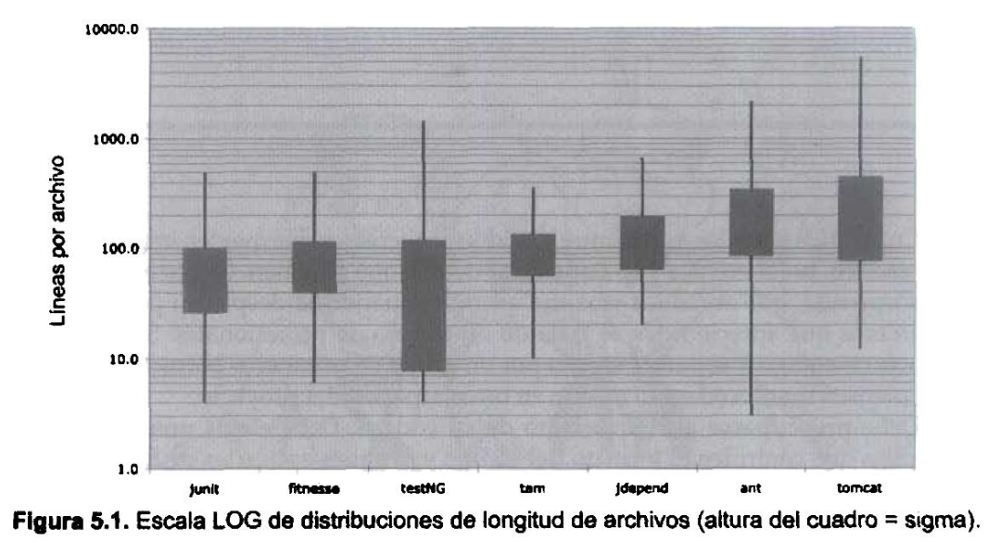
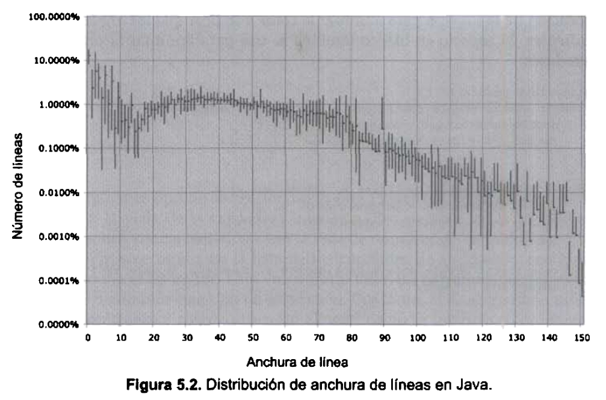

# <h1 style="color: MidnightBlue">Código limpio de Robert C. Martin :: _Mi "resumen_"</h1>

## <span style="color: darkcyan">Introducción:</span>

El libro se divide en tres partes:
    
__1__- Primera parte:
- Principios, patrones y prácticas para crear código limpio
- Incluye abundante código y resultan dificiles de leer
- Sirven como preparación para la segunda parte

__2__- Segunda parte:
- Casos cuya complejidad aumenta 
- Cada ejemplo es un ejercicio de limpieza de código
- Se alternará entre el texto y los listados de código
- Se tendrá que analizar y entender código, y comprender el razonamiento de cada cambio realizado

__3__- Tercera parte:
- Es un único capítulo
- Contiene una lista de heurística y síntomas de código erróneo confeccionada al crear los casos prácticos
- Es fundamental leer atentamente la segunda parte para sacar probecho de esta

En los capítulos de la segunda parte se anotarán todos los cambios realizados con referencias a la heurística.

Estas referencias se muestran entre corchetes, como <span style="color: Maroon">[H22]</span>

*_Heurística_: método para aumentar el conocimiento
*_Ley de LeBlanc_: después.. es igual que nunca

## <span style="color: darkcyan">1. Código limpio:</span>

### ¿El arte del código limpio?

Reconocer código limpio no significa que sepamos cómo crearlo.

Para crearlo se require el uso disciplinado de miles de técnicas aplicadas mediante un detallado "__sentido de la corrección__". Este sentido del código es la clave.

Un programador sin este sentido puede reconocer el desastre cometido en un módulo pero no saber cómo solucionarlo. Un programador con este sentido verá las posibles opciones y eligirá la variante óptima para definir una secuencia de cambios.

### Concepto de código limpio

Existen tantas definiciones como programadores. Por ello se consultan varias opiniones de conocidos y experimentados programadores:

> **Bjarne Stroustrup**  _Inventor de C++_:
> 
> Me gusta que mi código sea elegante y eficaz. La lógica debe ser directa para evitar errores ocultos, las dependencias deben ser mínimas para facilitar el mantenimiento, el procesamiento de errores completo y sujeto a una estrategia articulada, y el rendimiento debe ser óptimo para que lo usuarios no tiendan a estropear el código con optimizaciones sin sentido.

Bjarne usa la palabra elegante. Según el diccionario, "__elegante__" significa "dotado de gracia, nobleza y sencillez".

También menciona la __eficacia__ en dos ocasiones. Los ciclos malgastados no son elegantes.

Fíjese en la palabra empleada por Bjarne para describir la consecuencia de esta falta de elegancia. Usa _tiendan_. Una gran verdad. El código incorrecto tiende a aumentar el desastre. Cuando otros cambian código incorrecto, tienen a empeorarlo.

También menciona que el procesamiento de errores debe ser completo, lo que se relaciona con la disciplina de prestar atención a los detalles. En definitiva, el código limpio muestra gran atención al __detalle__.

__El código limpio es concreto. Cada función, cada clase y cada módulo muestran una única actitud que se mantiene invariable y no se contamina por los detalles circundantes__.

---

> **Grady Booch**  _Autor de Object Oriented Analysis and Design with Applications_: 
> 
> El código limpio es simple y directo. El código limpio se lee como un texto bien escrito. El código limpio no oculta la intención del diseñador sino que muestra nítidas abstracciones y líneas directas de control.

__El mensaje es claro, el código debe ser especifico y no especulativo. Solo debe incluir lo necesario__.

---

> **"Big" Dave Thomas**  _Fundador de OTI, padrino de la estrategia Eclipse_:
> 
> El código limpio se puede leer y mejorar por parte de un programador que no sea su autor original. Tiene pruebas de unidad y de aceptación. Tiene nombres con sentido. Ofrece una y no varias formas de hacer algo. Sus dependencias son mínimas, se definen de forma explícita y ofrece una API clara y mínima. El código debe ser culto en función del lenguaje, ya que no toda la información necesaria se puede expresar de forma clara en el código.

Big Dave comparte el deseo de Grady de la legibilidad pero con una importante variante. Dave afirma que el código limpio facilita las labores de mejora de otros. Puede parecer evidente pero no debemos excedernos. Despues de todo existe una diferencia entre el código fácil de leer y el código fácil de cambiar.

Dave __vincula la limpieza a las pruebas__. La disciplina del desarrollo controlado por pruebas ha tenido un gran impacto en nuestro nsector y se ha convertido en uno de sus pilares. __El código limpio, sin pruebas, no es limpio__, independientemente de su legibilidad, elegancia y accesibilidad. 

Valora el código de tamaño reducido. Cuanto más pequeño, mejor.

---

> **Michael Feathers**  _Autor de Working Effectively with Legacy Code_:
> 
> Podría enumera todas las cualidades del código limpio pero hay una principal que las engloba a todas ellas. __El código limpio siempre parece que ha sido escrito por alguien a quien le importa__. No hay nada evidente que hacer para mejorarlo. El autor del código pensó en todos los aspectos posibles y si intentamos imaginar alguna mejora, volvemos a punta de partida y solo nos queda disfrutar del código que alguien a quien le importa realmente nos ha proporcionado.

Prestar atención por lo detalles... preocuparse.

---

> **Ron Jeffries**  _Autor de Extreme Programming Installed y Extreme programming Adventures in C#_:
> 
> En los últimos años, comencé y prácticamente terminé con las reglas de código simple de Beck.
> En orden de prioridad, el código simple:
> - Ejecuta todas las pruebas.
> - No contiene duplicados.
> - Expresa todos los conceptos de diseño del sistema.
> - Minimiza el número de entidades como clases, métodos, funciones y similares.
>
> De todos ellos, me quedo con la duplicación. Cuando algo se repite una y otra vez, es una señal de que tenemos una idea que no acabamos de representar correctamente en el código. Intento determinar cuál es y, depués, expresar esa idea con mayor claridad. La expresividad debe incluir nombres con sentidos y estoy dispuesto a cambiar los nombres de las cosas varias veces.
>
> La expresividad va más allá de los nombres. También me fijo siun objeto o un método hacen más de una cosa. Si se trata de un objeto, probablemente tenga que dividirse en dos o más. Si se trata de un método, siempre recurro a la refactorización de extracción de métodos para generar un método que exprese con mayor claridad su cometido y varios métodos secundarios que expliquen cómo lo hace.

> __Reducir duplicados, maximizar la expresividad y diseñar sencillas abstracciones en las fases iniciales__. Para mí, es lo que hace que el código sea limpio.

---

> **Ward Cunningham**  _Inventor de Wiki, Fit, y uno de los inventores de la programación eXtreme. Uno de los impulsores de los patrones de diseño. Una de las mentes tras Smalltalk y la programación orientada a objetos. El padrino de todos a los que les importa el código_:
> 
> Sabemos que estamos trabajando con código limpio __cuando cada rutina que leemos resulta ser lo que esperabamos__. Se puede denominar código atractivo cuando el código hace que parezca que el lenguaje se ha creado para el problema en cuestión.

Ward espera que al leer código limpio no le sorprenda. De hecho, ni siquiera tendrá que esforzarse. Lo leerá y será practicamente lo que esperabas. Será evidente, sencillo y atractivo. Los programadores somos responsables de que el lenguaje parezca sencillo.

### Somos autores

El campo `@author` de un javadoc indica quiénes somos. __Somos autores__. De hecho, los autores son responsables de comunicarse correctament con sus lectores. __La próxima vez que escriba una línea de código, recuerde que es un autor y que escribe para que los lectores juzguen su esfuerzo__.

__La proporción entre tiempo dedicado a leer, frente a tiempo dedicado a escribir código es de más de 10:1.__ Constantemente tenemos que leer código antiguo como parte del esfuerzo de crear código nuevo.

__Al ser una proporción tan elevada, queremos que la lectura del código sea sencilla, aunque eso complique su creación. Evidentemente, no se puede escribir código sin leerlo, de modo que si es más facil de leer será más fácil de escribir. Es una lógica sin escapatoria.__

Si quiere avanzar rápidamente, terminar cuanto antes y que su código sea fácil de escribir, haga que sea fácil de leer.

### La regla del Boy Scout

No basta con escribir código correctamente. El código debe limpiarse con el tiempo. Hemos visto que el código se corrompe con el tiempo, de modo que __debemos adoptar un papel activo para evitarlo__.

Los Boy Scouts norteamericanos tienen una sencilla regla que podemos aplicar a nuestra profesión:

> Dejar el campamento más limpio de lo que se ha encontrado.

No hace falta que la limpieza sea masiva. Cambie el nombre de una variable, divida una función demasiado extensa, elimine elementos duplicados, simplifique una instrucción if compuesta.

__¿Se imagina trabajar en un proyeto en el que el código mejorará con el tiempo? ¿Cree que hay otras opciones que puedan considerarse profesionales? De hecho, ¿la mejora continuada no es una parte intrínseca de la profesionalidad?__

### Precuela y principios

En este libro encontrará referencias esporádicas a distintos _principios de diseño_ como:
- SRP (Single Responsibility Principle o Principio de responsabilidad única) 
- OCP (Open Closed Principle o Principio Abierto/Cerrado) 
- DIP (Dependency Inversión Principle o Principio de inversión de dependencias)

Entre otros.

### Conclusión

Este libro no puede prometer que se convierta en un buen programador, que tenga sentido del código. Solo puede mostrarle los procesos de pensamient de buenos programadores y los trucos, técnicas y heramientas que emplean.

En este libro encontrará mucho código. Verá código correcto y código incorrecto. Verá código incorrecto transformado en código correcto. Verá listas de heurística, disciplinas y técnicas. Verá un ejemplo tras otro. Y __después de todo, será responsabilidad suya__.

_¿Recuerdan el chiste sobre el violinista que se pierde camino de un concierto? Se cruza con un anciano y le pregunta cómo llegar al Teatro Real. El anciano mira al violinista y al violín que lleva bajo el brazo y le responde: "Practique jove, practique"._

## <span style="color: darkcyan">2. Nombres con sentido:</span>

### Usar nombres que revelen las intenciones

Es fácil afirmar que los nombres deben revelar nuestras intenciones. Lo que queremos recalcar es la importancia de hacerlo. Elegir nombres correctos lleva tiempo pero también ahorra trabajo. Por ello, preste atención a los nombres y cámbielos cuando encuentre otros mejores. Todo el que lea su código se lo agradecerá.
El nombre de una variable, función o clase debe responder una serie de cuestiones básicas. __Debe indicar por qué existe, qué hace y cómo se usa. Si un nombre require un comentario, significa que no revela su cometido.__

`int d; // tiempo trascurrido en días`

El nombre `d``no revela nada. No evoca una sensación de tiempo transcurrido, ni de días.
Debe elegir un nombre que especifique lo que se mide y la unidad de dicha medida:

```java
    int elapsedTimeInDays;
    int daysSinceCreation;
    int daysSinceModification;
    int fileAgeInDays;
```

__La elección de nombres que revelen intenciones facilita considerablemente la comprensión y la modificación del código__. ¿Para que sirve el siguiente código?

```java
    public List<int[]> getThem() {
        List<int[]> list1 = new ArrayList<int[]>();
        for (int[] x : theList)
            if (x[0] == 4)
                list1.add(x);
        return list;
    }
```

¿Por qué es complicado saber la función de este código? No hay expresiones complejas.
Los espacios y el sangrado son razonables. Solo hay tres variables y dos constantes. Ni siquiera contiene clases complejas o métodos polimórficos, solo una lista de matrices (o eso parece).

__El problema no es la simplicidad del código sino su carácter implícito: el grado en el que el contexto no es explicito en el propio código__. Inplícitamente, el código requiere que sepamos las respuestas a las siguientes preguntas:

- ¿Qué contiene `theList`?
- ¿Qué significado tiene el subíndice cerp de un elemento de `theList`?
- ¿Qué importancia tiene el valor 4?
- ¿Cómo se usa la lista devuelta?

Las respuestas a estas preguntas no se encuentran en el código pero se podrían haber incluido. Imagine que trabaja en un juego de buscar minas. El tablero es una lista de celdas llamada `theList`. Cambiemos el nombre por `gameBoard`.
Cada celda del teclado se representa por medio de una matriz. El subíndice cero es la ubicación de un valor de estado que, cuando es 4, significa que se ha detectado. Al asignar nombres a estos conceptos mejoramos considerablemente el código:

```java
    public List<int[]> getFlaggedCells() {
        List<int[]> flaggedCells = new ArrayList<int[]>();
        for (int[] cell : gameBoard)
            if (cell[STATUS_VALUE] == FLAGGED)
                flaggedCells.add(cell);
            return flaggedCells;
    }
```

Podemos crear una sencilla clase para celdas en lugar de usar una matriz de elementos `int`. Puede incluir una función que revele el objetivo (con el nombre `isFlagged`) para ocultar los números. El resultado es una nueva versión de la función:

```java
    public List<Cell> getFlaggedCells() {
        List<Cell> flaggedCells = new ArrayList<Cell>();
        for (Cell cell : gameBoard)
            if (cell.isFlagged())
                flaggedCells.add(cell);
            return flaggedCells;
    }
```

Con estos sencillos cambios de nombre, es fácil saber qué sucede. Es la ventaja de seleccionar nombres adecuados.

### Evitar la desinformación

Los programadores deben evitar dejar pistas falsas que dificulten el significado del código. Debemos evitar palabras cuyo significado se aleje del que pretendemos.

Por ejemplo,

No haga referencia a un grupo de cuentas como `accountList` a menos que realmente sea una lista (`List`). La palabra lista tiene un significado concreto para los programadores. Si el contenedor de las cuentas no es realmente una lista, puede provocar falsas conclusiones. Por tanto resulta más adecuado usar `accountGroup, bunchOfAccounts` o simplemente `accounts`.

Evite usar nombres con variaciones mínimas. ¿Cuánto se tarda en apreciar la sutil diferencia entre `XYZControllerForEfficientHandlingOfStrings` y `XYZControllerForEfficientStorageOfStrings` en un módulo? Ambas palabras tienen una forma similar.

__La ortografía similar de conceptos parecidos es información; el uso de la ortografía incoherente es desinformación__.

Un ejemplo de nombre desinformativo sería el uso de la `l` minúscula o la `O` mayúscula como nombres de variables, sobre todo combinados. El problema, evidentemente, es que se parecen a las constantes 1 y 0 respectivamente.

### Realizar distinciones con sentido

Los programadores se crean un problema al crear código únicamente dirigido a un compilador o intérprete. Por ejemplo, como se puede usar el mismo nombre para hacer referencia a dos elementos distintos en el mismo ámbito, puede verse tentado a cambiar un nombre de forma arbitraria. En ocasiones se hace escribiéndolo incorrectamente, lo que provoca que los errores ortográficos impidan la compilación.

No basta con añadir series de números o palabras adicionales, aunque eso satisfaga al compilador. __Si los nombres tienen que ser distintos, también deben tener un significado diferente__.

Los nombres de series de numéricas `(a1, a2, ..aN)` son lo contrario a los nombres intencionados. No desinforman, simplemente no ofrecen información; son una pista sobre la intención del autor. Fíjese en lo siguiente:

```java
    public static void copyChars(char a1[], char a2[]) {
        for (int i=0; i<a1.length; i++) {
            a2[i] = a1[i];
        }
    }
```

Esta función se lee mejor cuando se usa `source` y `destination` como nombres de argumentos.

Las palabras adicionales son otra distinción sin sentido. Imagine que tiene la clase `Product`. Si tiene otra clase con el nombre `ProductInfo` o `ProductData` __habrá creado nombres distintos pero con el mismo significado__. `Info` y `Data` son palabras adicionales, como `a`, `an` y `the`.

No es incorrecto usar prefijos como `a` y `the` mientras la distinción tenga sentido. Imagine que usa `a` para variables locales y `for` para argumentos de funciones. El problema aparece cuando decide invocar la variable `theZork` porque ya tiene otra con la variable `zork`.

Las palabras adicionales son redundantes. La palabra `variable` no debe incluirse nunca en el nombre de una variable. La palabra `table` no debe incluirse nunca en el nombre de una tabla. ¿Es mejor `NameString` que `Name`? ¿Podría ser `Name` un número de coma flotante? En caso afirmativo, incumple la regla anterior sobre la desinformación.
Imagine que encuentra una clase con el nombre `Customer` y otra con el nombre `CustomberObject`. ¿Cuál sería la distinción? ¿Cuál representa mejor el historial de pagos de un cliente?
Existe una aplicación que lo ilustra. Hemos cambiado los nombres para proteger al culpable. Veamos el error exacto:

```java
    getActiveAccount();
    getActiveAccounts();
    getActiveAccountInfo();
```

¿Cómo saben los programadores de este proyecto qué función debe invocar?
En ausencia de convenciones concretas, la variable `moneyAmount` no se distingue de `account` y `theMessage` no se distingue de `message`. __Debe diferenciar los nombres de forma que el lector aprecie las diferencias__.

### Usar nombres que se puedan pronunciar

Evite a toda costa el uso de variables como `genymdhms` (fecha de generación, año, mes, día, hora, minuto y segundo).

Compare:

```java
    class DtaRcrd102 {
        private Date genymdhms;
        private Date modymdhms;
        private final String pszqint = "102";
        /* ... */
    }
```
con:

```java
    class Customer {
        private Date generationTimestamp;
        private Date modificationTimestamp;
        private final String recordId = "102";
        /* ... */
    }
```

### Usar nombres que se puedan buscar

Los nombres de una letra y las constantes numéricas tienen un problema: no son fáciles de localizar en el texto. Se puede detectar `MAX_CLASSES_PER_STUDENT`, pero el número `7` resulta más complicado. A este respecto, los nombres extensos superan a los breves.

Personalmente prefiero nombres de una letra que solo se puedan usar como variables locales dentro de métodos breves. __La longitud de un nombre debe corresponderse al tamaño de su ámbito__ <span style="color: Maroon">[N5]</span>. Si una variable o constante se usa en varios puntos del código, debe asignarle un nombre que se pueda buscar.

Compare:

```java
    for (int j=0; j<34; j++) {
        s += (t[j]*4)/5;
    }
```

con:

```java
    int realDaysPerIdealDay = 4;
    const int WORK_DAYS_PER_WEEK = 5;
    int sum = 0;

    for (int j=0; j<NUMBER_OF_TASKS; j++) {
        int realTaskDays = taskEstimate[j] * realDaysPerIdealDay;
        int realTaskWeeks = (realdays / WORK_DAYS_PER_WEEK);
        sum += realTaskWeeks;
    }
```

En este ejemplo `sum` no es un nombre especialmente útil pero al menos se puede buscar. Se usa una función más extensa pero comprobará que resulta mucho más fácil buscar WORK_DAYS_PER_WEEK que todas las instancias de 5 y filtrar la lista a los casos con el significado adecuado.

### Evitar codificaciones

Ya tenemos suficientes codificaciones como para tener que añadir otras nuevas. Al __codificar información de tipos o ámbitos en un nombre se dificulta la descodificación__.
No parece razonable que todos los nuevos empleados tengan que aprender otro lenguaje de codificación además del código con el que van a trabajar. Es una carga mental innecesaria a la hora de intentar solucionar un problema. Los nombres codificados resultan impronunciables y suelen escribirse de forma incorrecta.

### Interfases e implementaciones

Existe un caso especial para usar codificaciones. Imagine por ejemplo que crea una factoría abstracta para crear formas. Esta fartoría será una intefaz y se implementará por medio de una clase concreta. ¿Qué nombres debe asignar? ¿`IShapeFactory` y `ShapeFactory`? __Prefiero las interfases sin adornos__. La `I` inicial, tan habitual en los archivos de legado actuales __es, en el mejor de los casos, una distracción, y en el peor, un exceso de información__. No quiero que mis usuarios sepan que se trata de una interfaz, solamente que se trata de `ShapeFactory`. __Si tengo que codificar la interfaz o la implementación, opto por ésta última.__ Es mejor usar `ShapeFactoryImp` o incluso `CShapeFactory`, que codificar la interfaz.

### Evitar asignaciones mentales

__Los lectores no tienen que traducir mentalmente sus nombres en otros que ya conocen.__ Este problema suele aparecer al elegir entre no usar términos de dominio de problemas o de soluciones. Es un problema que los nombres de variables de una sola letra. Un contador de bucles se podría bautizar como `i`, `j` o `k` (pero nunca `l`) si su ámbito es muy reducido y no hay conflictos con otros nombres, ya que de una letra son muy tradicionales los contadores de bucles. Sin embargo, en la mayoria de los casos un nombre de una letra es una opción muy pobre.

__Una diferencia entre un programador inteligente y un programador profesional es que este último sabe que la claridad es lo que importa`. Los profesionales usan sus poderes para hacer el bien y crean código que otros puedan entender.

__Nombres de clases__

Las clases y los objetos deben tener nombres o frases de nombre como `Customer, WikiPage, Account y AddresParser`. __Evite__ palabras como `Manager, Processor, Data,` o `Info` en el nombre de una clase. __El nombre de la clase no debe ser un verbo__.

### Nombres de métodos

__Los métodos deben tener nombres de verbo__ como `postPayment`, `deletePage` o `save`. Los métodos de acceso, de modificación y los predicados deben tener como nombre su valor y usar como prefijo `get`, `set` e `is` de acuerdo al estàndar de javabean.

```java
    string name = employee.getName();
    customer.setName("mike");
    if (paycheck.isPosted())...
```

__Al sobrecargar constructores, use métodos de factoría estáticos con nombres que escriban los argumentos__. Por ejemplo:

```java
    Complex fulcrumPoint = Complex.FromRealNumber(23.0);
```

es mejor que:

```java
    Complex fulcrumPoint = new Complex(23.0);
```

__Refuerce su uso convirtiendo en privados sus constructores correspondientes__.

### No se exceda con el atractivo

Si los nombres son demasiado inteligentes, solo los recordarán los que compartan el sentido del humor de su autor, y solo mientras se acuerden del chiste. ¿Sabrán qué significa la función `HolyHandGranade`? Sin duda es atractiva pero en este caso puede que `DeleteItems` fuera más indicado. Opte por la claridad antes que por el entretenimiento. En el código, el atractivo suele aparecer como formas coloquiales o jergas. Por ejemplo, no use `whack()` en lugar de `kill()`. No recurra a bromas culturales como `eatMyShorts()` si quiere decir `abort()`.
__Diga lo que piense. Piense lo que diga__.

<a name="palabra_por_concepto"></a>
### Una palabra por concepto

Elija una palabra por cada concepto abstracto y manténgala. Por ejemplo, resulta confuso usar `fetch`, `retrieve` y `get` como métodos equivalentes de clases distintas.
¿Cómo va a recordar qué método se corresponde a cada clase? Desafortunadamente, tendrá que recordar qué empresa, grupo o individuo ha creado la biblioteca o clase en cuestión para recordar qué términos se ha empleado. En caso contrario, perderá mucho tiempo buscando en encabezados y fragmentos de código.

__Los nombres de funciones deben ser independientes y coherentes para que pueda elegir el método correcto sin necesidad de búsquedas adicionales__.

Del mismo modo, resulta confuso tener un controlador, un administrador y un control en la misma base de código. ¿Cuál es la diferencia entre `DeviceManager` y `ProtocolController`?¿Por qué no son los dos controladores o administradores? ¿Son controladores? El nombre hace que espere que dos objetos tengan un tipo diferente y clases diferentes.
__Un léxico coherente es una gran ventaja para los programadores que tengan que usar su código__.

### No haga juegos de palabras

__Evite usar la misma palabra con dos fines distintos__. Suele hacerse en juegos de palabras. Si aplica la regla de [una palabra por concepto](#palabra_por_concepto), acabará con muchas clases que por ejemplo tengan un método `add`. Mientras las listas de parámetros y los valores devueltos de los distintos métodos `add` sean semánticamente equivalentes, no hay problema.
Sin embargo, alguien puede decidir usar la palabra `add` por motivos de coherencia, aunque no sea e el mismo sentido. Imagine que hay varias clases en las que `add` crea un nuevo valor sumando o concatenando dos valores existentes.  Imagina ahora que crea una nueva clase con un método que añada su parámetro a una colección. ¿Este método debe tener el método `add`? Parece coherente ya que ha otrs muchos métodos `add`, pero en este caso hay una diferencia semántica, de modo que debemos usar un nombre como `insert` o `append`. Llamar `add` al nuevo método sería un juego de palabras.
Nuestro objetivo, como autores, es facilitar la compresión del código. Queremos que el código sea algo rápido, no un estudio exhaustivo. Queremos usar un modelo en el que el autor sea el responsable de transmitir el significado, no un modelo académico que exija investigar el significado mostrado.

### Usar nombres de dominios de soluciones

Recuerde que los lectores de su código serán programadores. Por ello, __use términos informáticos, algoritmos, nombres de patrones, términos matemáticos y demás__. No conviene extraer todos los nombres del dominio de problemas ya que no queremos que nuestros colegas tengan que preguntar el significado de cada nombre en especial cuando ya conocen el concepto bajo otro nombre diferente.
El nombre `AccountVisitor` tiene mucho significado para un programador familiarizado con el patrón `VISITOR`.
Hay cientos de cosas técnicas que los programadores tienen que hacer y __elegir nombres técnicos__ para dichas cosas __suele ser lo más adecuado__.

### Usar nombres de dominios de problemas

__Cuando no exista un término de programación para lo que esté haciendo, use el nombre del dominio de problemas__. Al menos el programador que mantenga su código podrá preguntar el significado a un experto en dominios.
Separar los conceptos de dominio de soluciones y de problemas es parte del trabajo de un buen programador y diseñador. El código que tenga más relación con los conceptos del dominio de problemas tendrá nombres extraídos de dicho dominio.

### Añadir contexto con sentido

Algunos nombres tienen significado por si mismos, pero la mayoría no. Por ello, __debe incluirlos en un contexto, en clases, funciones y espacios de nombres con nombres adecuados__. __Cuando todo lo demás falle, pueden usarse prefijos como último recurso__.

Imagine que tiene las variables `firstName`, `lastName`, `street`, `houseNumber`, `city`, `state` y `zipcode`. Si las combina, es evidente que forman una dirección. Pero si la variable `state` se usa de forma aislada en un método, ¿sabría que forma parte de una dirección? Puede añadir contexto por medio de prefijos: `addrFirstName`, `addrLastName`, `addrState`, etc. Al menos los lectores comprenderán que estas variables forman parte de una estructura mayor. __Evidentemente, es mejor crear la clase__ `Address`. De ese modo, incluso el compilador sabrá que las variables pertenecen a un concepto más amplio.

Fíjese en el método del __listado 2.1.__ ¿Las variables necesitan un contexto con más sentido? El nombre de la función solo ofrece parte del contexto, el resto se obtiene del algoritmo. Tras leer la función, verá que las tres variables `number`, `verb` y `pluralModifier` forman parte del mensaje `guess statistics`. Desafortunadamente, es necesario inferir el contexto. Al leer el método, el significado de las variables no es evidente.

> __Listado 2.1.__ Variables en un contexto ambiguo.
```java
    private void printGuessStatistics(char candidate, int count) {
        String number;
        String verb;
        String pluralModifier;
        if (count == 0) {
            number = "no";
            verb = "are";
            pluralModifier = "s";
        } else if (count == 1) {
            number = "1";
            verb = "is";
            plurarModifier = "";
        } else {
            number = Integer.toString(count);
            verb = "are";
            pluralModifier = "s";
        }
        String guessMessage = String.format(
            "There %s %s %s%s", verb, number, candidate, pluralModifier
        );
        print(guessMessage);
    }
```

La función es demasiado extensa y las variables aparecen por todas partes. Para dividir la función en fragmentos más reducidos necesitamos crear una clase `GuessStatisticsMessage` y convertir a las tres variables en campos de la misma. De este modo contamos con un contexto más obvio para las tres variables. Forman parte sin duda de `GuessStatisticsMessage`. La mejora del contexto también permite que el algoritmo sea más limpio y se divida en funciones más reducidas(véase el __listado 2.2.__)

> __Listado 2.2.__ Variables con un contexto.
```java
    public class GuessStatisticsMessage {

        private String number;
        private String verb;
        private String pluralModifier;

        public String make(char candidate, int count) {
            createPluralDependentMessageParts(count);
            return String.format(
                "There %s %s %s%s",
                verb, number, candidate, pluralModifier
            );
        }

        private void createPluralDependentMessageParts(int count) {
            if (count == 0) {
                thereAreNoLetters();
            } else if {
                thereIsOneLetter();
            } else {
                thereAreManyLetters(count);
            }
        }

        private void thereAreManyLetters(int count) {
            number = Integer.toString(count);
            verb = "are";
            pluralModifier = "s";
        }

        private void thereIsOneLetter() {
            number = "1";
            verb = "is";
            plural = "";
        }

        private void thereAreNoLetters() {
            number = "no";
            verb = "are";
            pluralModifier = "s";
        }

    }
```

### No añadir contextos innecesarios

En la aplicación imaginaria Gas Station Deluxe, no es aconsejable usar el prefijo `GSD` en todas las clases. El trabajar contra las herramientas proporcionadas. Introduzca G y pulse la tecla de finalización para acceder a una lista interminable de todas las clases del sistema. ¿Es lo correcto? ¿Por qué dificultar la ayuda del IDE?
Del mismo modo, imagine que ha creado la clase `MailingAddress` en un módulo de contabilidad de `GSD`, con el nombre `GSDAccountAddress`. Después, necesita una dirección de correo para la aplicación de contacto con el cliente. ¿Usará `GSDAccountAddress`? ¿Le parece el nombre correcto? 10 de los 17 caracteres son redundantes o irrelevantes. __Los nombres breves suelen ser más adecuados que los extensos, siempre que sean claros__. No añada más contexto del necesario a un nombre. Los nombres `accountAddress` y `custumerAddress` son perfectos para instancias de la clase `Address` pero no sirven como nombres de clase. `Address` sirve como nombre de clase. Para distinguir entre direcciones MAC, direcciones de puertos y direcciones Web, podría usar `PostalAddress`, `MAC` y `URI`. Los nombres resultantes son más precisos, el objetivo de cualquier nombre.

### Conclusión

__Lo más complicado a la hora de elegit un buen nombre es que require habilidad descriptiva y acerbo cultural__. Es un problema de formación más que técnico, empresarial o administrativo. Como resultado, mucha gente del sector no aprende a hacerlo bien.
__La gente teme que al cambiar los nombres otros programadores se quejen. Nosotros no compartimos ese temor y agradecemos los cambios de nombre__ (siempre que sean a mejor).En muchos casos no memorizamos los nombres de clases y métodos. Usamos herramientas modernas para estos detalles y así poder centrarnos en si el código se lee como frases o párrafos, o al menos como tablas y estructura de datos (una frase no siempre es la mejor forma de mostrar los datos). __Seguramente acabará sorprendiendo a alguien cuando cambie los nombres, como puede suceder con cualquier otra mejora del código. No deje que le detenga__.
Aplique estas reglas y compruebe si mejora o no la legibilidad de su código. Si es el encargado de mantener código de terceros, use herramientas para solucionar estos problemas. Obtendrá recompensas a corto y largo plazo.

## <span style="color: darkcyan">3. Funciones</span>

En los inicios de la programación,creábamos sistemas a partir de rutinas y subrutinas.
Después, en la época de Fortran y PL/1, creábamos nuestros sistemas con programas, subprogramas y funciones. En la actualidad, sólo las funciones han sobrevivido. __Son la primera línea organizativa en cualquier programa__. En este capítulo veremos cómo crearlas.
Fíjese en el código del listado 3.1. Es complicado encontrar una función extensa en FitNesse, pero acabé encontrando ésta. No sólo es extensa, sino que también contiene código duplicado, muchas cadenas y tipos de datos extraños, además de API poco habituales y nada evidentes. Intente comprenderlo en los próximos tres minutos.

> __Listado 3.1.__ HtmlUtil.java (FitNesse 20070619).

```java
    public static String testableHtml(
        PageData pageData,
        boolean includeSuiteSetup
    ) throws Exception {
        WikiPage wikiPage = pageData.getWikiPage();
        StringBuffer buffer = new StringBuffer();
        if (pageData.hasAttribute("Test")) {
            if (includeSuiteSetup) {
                WikiPage suiteSetup =
                    PageCrawlerImpl.getInheritedPage(
                        SuiteResponder.SUITE_SETUP_NAME, wikiPage
                    );
            }
            if (suiteSetup != null) {
                WikiPagePath pagePath = 
                    suiteSetup.getPageCrawler().getFullPath(suiteSetup);
                buffer.append("!include -setup .")
                    .append(pagePathName)
                    .append("\n");
            }
        }
        WikiPage setup =
            PageCrawlerImpl.getInheritedPage("SetUp", wikiPage);
        if (setup != null) {
            WikiPagePath setupPath =
                wikiPage.getPageCrawler().getFullPath(setup);
            String setupPathName = PathParse.render(setupPath);
            buffer.append("!include -setup .")
                .append(setupPathName)
                .append("\n");
        }
        buffer.append(pageData.getContent());
        if (dataPage.hasAttribute("Test")) {
            WikiPage teardown =
                PageCrawlerImpl.getInheritedPage("TearDown", wikiPage);
            if (teardown != null) {
                WikiPagePath tearDownPath =
                    wikiPage.getPageCrawler().getFullPath(teardown);
                String tearDownPathName = PathParser.render(tearDownPath);
                buffer.append("\n")
                    .append("!include -teardown .")
                    .append(tearDownPathName)
                    .append("\n");
            }
            if (includeSuiteSetup) {
                WikiPage suiteTeardown = 
                PageCrawlerImpl.getInheritedPage(
                    SuiteResponder.SUITE_TEARDOWN_NAME,
                    wikiPage
                );
                if (suiteTeardown != null) {
                    WikiPagePath pagePath =
                        suiteTeardown.getPageCrawler().getFullPath(suiteTeardown);
                    String pagePathName = PathParser.render(pagePath);
                    buffer.append("!include -teardown .")
                        .append(pagePathName)
                        .append("\n");
                }
            }
        }
        pageData.setContent(buffer.toString());
        return pageData.getHtml();
    }
```

¿Tras tres minutos entiende la función? Seguramente no. PAsan demasiadas cosas y hay demasiados niveles de abstracción diferentes. Hay cadenas extrañas e invocaciones de funciones mezcladas en instrucciones `if` doblemente anidadas controladas por indicadores. Sin embargo, __con sencillas extracciones de código, algún cambio de nombres y cierta reestructuración, pude capturar la intención de la función__ en las nueve líneas del __listado 3.2.__ Compruebe si ahora la entiende.

>__Listado 3.2.__ HtmlUtil.java(refactorización).
```java
    public static String renderPageWithSetupsAndTeardowns(
        PageData pageData, boolean isSuite
    ) throws Exception {
        boolean isTestPage = pageData.hasAttribute("Test");
        if (isTestPage) {
            WikiPage testPage = pageData.getWikiPage();
            StringBuffer newPageContent = new StringBuffer();
            includeSetupPages(testPage, newPageContent, isSuite);
            newPageContent.append(pageData.getContent());
            includeTeardownPages(testPage, newPageContent, isSuite);
            pageData.setContent(newPageContent.toString());
        }
        return pageData.getHtml()
    }
```

A menos que sea un alumno de FitNesse, seguramente no entienda los detalles.
Entenderá que la función se encarga de añadir páginas de configuración y detalles en una página de prueba, que después muestra en HTML. Si está familiarizado con JUnit, verá que esta función pertenece a algún tipo de estructura de pruebas basada en la Web y, evidentemente, es correcto. Resulta sencillo adivinar esta información del __listado 3.2.__ pero no del __listado 3.1.__ ¿Qué tiene la función del listado 3.2. para que resulte sencilla de leer y entender? ¿Qué hay que hacer para que una función transmita su intención? ¿Qué atributos podemos asignar a nuestras funciones para que el lector pueda intuir el tipo de programa al que pertenecen?

### Tamaño reducido

__La primera regla de las funciones es que deben ser de tamaño reducido. La segunda es que deben ser todavía más reducidas__. No puedo mostrar mostrar referencias a estudios que demuestren que las funciones muy reducidas sean mejores. Lo que sí puedo afirmar es que durante casi cuatro décadas he creado funciones de diferentes tamaños. He creado monstruos de 3.000 líneas y otras muchas funciones de entre 100 y 300 líneas. También he creado funciones de 20 a 30 líneas de longitud. Esta experiencia me ha demostrado, mediante ensayo y error, que las funciones deben ser muy reducidas.

En la década de 1980 se decía que una función no debía superar el tamaño de una pantalla. Por aquel entonces, las pantallas VT100 tenían 24 líneas por 80 columnas, y nuestros editores usaban 4 líneas para tareas administrativas. En la actualidad, con una fuente mínima y un monitor de gran tamaño, se pueden encajar 150 caracteres por línea y 100 líneas o más en una pantalla. Las líneas no deben tener 150 caracteres. Las funciones no deben tener 100 líneas de longitud. __Las funciones deben tener una longitud aproximada de 20 líneas__.
¿Qué tamaño mínimo debe contener una función? En 1999 visité a Kent Beck en su casa de Oregon. Nos sentamos y comenzamos a programar. Me enseñó un atractivo programa de Java/Swing que había llamado Sparkle. Generaba un efecto visual en pantalla, similar a la varita mágica del hada de Cenicienta. Al mover el ratón, salían estrellitas del cursor, y descendían a la parte inferior de la pantalla en un campo gravitatorio simulado. Cuando Kent me enseñó el código, me sorprendió la brevedad de las funciones. Estaba acostumbrado a ver programas de Swing con funciones que ocupaban kilómetros de espacio vertical. En este programa, las funciones tenían dos, tres o cuatro líneas de longitud. Todas eran obvias. Todas contaban una historia y cada una llevaba a la siguiente en un orden atractivo. ¡Así de breves deberían ser todas las funciones!
¿Qué tamaño mínimo deben tener sus funciones? Deberían ser más breves que las del __listado 3.2.__ De hecho, el __listado 3.2.__ debería reducirse como en __listado 3.3.__

>__Listado 3.3.__ HtmlUtil.java (nueva refactorización)
```java
    public static String renderPageWithSetupAndTeardowns(
        PageData pageData, boolean isSuite) throws Exception {
        if (isTestPage(pageData))
            includeSetupAndTeardownPages(pageData, isSuite);
        return pageData.getHtml();
    }
```

### Bloques y sangrado

Esto implica que los bloques en instrucciones `if`, `else`, `while` y similares __deben tener una línea de longitud que, seguramente, sea la invocación de una función. De esta forma, no solo se reduce el tamaño de la función, sino que también se añade valor documental__ ya que la función invocada desde el bloque puede tener un nombre descriptivo. También implica que las funciones no deben tener un tamaño excesivo que albergue estructuras anidadas. Por tanto, el nivel de sangrado de la función no debe ser mayor de uno o dos. Evidentemente, de esta forma las funciones son más fáciles de leer y entender.

### Hacer una cosa

Es evidente que el __listado 3.1.__ hace más de una cosa. Crea búfers, obtiene páginas, busca páginas heredadas, añade cadenas antiguas y genera HTML. El __listado 3.1.__ está muy ocupado realizando varias tareas. por su parte, el __listado 3.3.__ solo hace una cosa: incluye configuraciones y detalles en páginas de prueba.

---

El siguiente consejo lleva vigente, de una u otra forma, durante más de 30 años:

> ## LAS FUNCIONES SOLO DEBEN HACER UNA COSA. DEBEN HACERLO BIEN Y DEBE SER LO ÚNICO QUE HAGAN.

El problema de esta afirmación es saber qué es una cosa. ¿El __listado 3.3.__ hace una cosa? Se podría pensar que hace tres:

    1. Determinar si la página es una página de prueba.
    2. En caso afirmativo, incluir configuraciones y detalles.
    3. Representar la página en HTML. 

¿Cuál será de las tres? ¿La función hace una o tres cosas? Los tres pasos de la función se encuentran un nivel de abstraccion por debajo del nombre de la función. __Podemos describir la función como un breve párrafo TO(PARA)__:

> * _El lenguaje LOGO usaba la palabra clave TO al igual que Ruby y Python usaban def. Por tanto, todas las funciones comenzaban por TO, lo que tenía un efecto interesante en cómo se diseñaban_.

> Para `RenderPageWithSetupsAndTeardowns`, comprobamos si la página es de prueba y, en caso afirmativo, incluimos la configuración y los detalles. En ambos casos, la representamos en HTML.

__Si una función solo realiza los pasos situados un nivel por debajo del nombre de la función, entonces hace una cosa__. En definitiva creamos funciones para descomponer conceptos más amplios (es decir, el nombre de la función) en un conjunto de pasos en el siguiente nivel de abstracción, por lo que es obvio que hace más de una cosa. Incluso el __listado 3.2.__ tiene tres niveles de abstracción, como ha demostrado la capacidad de reducirlo, pero sería complicado reducir con sentido el __listado 3.3.__ Podríamos extraer la instrucción `if` en la función `includeSetupsAndTeardownsIfTestPage`, pero solo reduciríamos el código __sin cambiar el nivel del abstracción__.

Por ello, __otra forma de saber que una función hace más de una cosa es extraer otra función de la misma con un nombre que no sea una reducción de su implementación__. <span style="color: Maroon">[G34]</span>

### Secciones en funciones

Fíjese en el __listado 4.7.__ Verá que la función `generatePrimes` se divide en secciones como declaraciones, inicializaciones y filtros. Es un síntoma evident de que hace más de una cosa. __Las funcionesque hacen una sola cosa no se pueden dividir en secciones__.

### Un nivel de abstracción por función

Para que las funciones realicen "una cosa", __asegúrese de que las instrucciones de la función se encuentran en el mismo nivel de abstracción__.  El __listado 3.1.__ inclumple esta regla. Incluye conceptos a un elevado nivel de abstracción, como `getHtml();` otros se encuentran en un nivel intermedio, como `String pagePathName = PathParser.render(pagePath)` y hay otros en un nivel especialmente bajo, como `.append("\n")`. __La mezcla de niveles de abstracción en una función siempre resulta confusa__. Los lectores no sabrán si una determinada expresión es un concepto esencial o un detalle. __Peor todavía, si se mezclan detalles con conceptos esenciales, aumentarán los detalles dentro de la función__.

### Leer código de arriba a abajo: la regla descendente

El objetivo es que el código se lea como un texto de arriba a abajo. __Queremos que tras todas las funciones aparezcan las del siguiente nivel de abstracción para poder leer el programa, descendiendo un nivel de abstracción por vez mientras leemos la lista de funciones__. Es lo que denomino la regla descendente.

A los programadores les resulta complicado aprender esta regla y crear funciones en un único nivel de abstracción, pero un truco importante. __Es la clave para reducir la longitud de las funciones y garantizar que solo hagan una cosa__. Al conseguir que el código se lea de arriba a abajo, se mantiene la coherencia de los niveles de abstracción.
Fíjese en el __listado 3.7.__ del final del capítulo. Muestra la función `testableHtml` modificada de acuerdo a estos principios. Cada función presenta a la siguiente y se mantiene en un nivel de abstracción coherente.

### Instrucciones Switch

Es complicado usar una instrucción `switch` de tamaño reducido. Aunque solo tenga dos casos, es mayor de lo que un bloque o función debería ser. También es complicado crear una instrucción `switch` que haga una sola cosa. Por su naturaleza, las instrucciones `switch` siempre hacen N cosas. Desafortunadamente, __no siempre podemos evitar las instrucciones `switch` pero podemos asegurarnos de incluirlas en una clase de nivel inferior y de no repetirlas__. Para ello __recurrimos al polimorfismo__. Fíjese en el __listado 3.4.__ Muestra una de las operaciones que pueden depender del tipo de empleado.

> __Listado 3.4.__ Payroll.java

```java
    public Money calculatePay(Employee e) 
    throws InvalidEmployeeType {
        switch (e.type) {
            case COMMISSIONED:
                return calculateCommisionedPay(e);
            case HOURLY:
                return calculateHourlyPay(e);
            case SALARIED:
                return calculateSalariedPay(e);
            default:
                throw new InvalidEmployeeType(e.type);
        }
    }
```

Esta función tiene varios problemas. Por un lado, es de gran tamaño y cuando se añadan nuevos tipos de empleado, aumentará más. Por otra parte, hace más de una cosa.
También incumple el Principio de responsabilidad única (Single Responsability Principle o SRP) ya que hay más de un motivo para cambiarla. Además, incumple el Principio abierto/cerrado (Open Closed Principle u OCP), ya que debe cambiar cuando se añadan nuevos tipos, pero posiblemente el peor de los problemas es que hay un número ilimitado de funciones que tienen la misma estructura.
Por ejemplo, podríamos tener:

```java
    isPayday(Employee e, Date date),
```
ó
```java
    deliverPay(Employee e, Money pay),
```
o muchas otras, todas con la misma estructura.

__La solución al problema__ (véase el __listado 3.5__) __consiste en ocultar la instrucción `switch` en una factoría abstracta e impedir que nadie la vea__. La factoría usa la instrucción `switch` para crear las instancias adecuadas a los derivados de `Employee` y las distintas funciones, como `calculatePay`, `isPayday` y `deliverPay`, se entregarán de forma polifórmica a través de la interfaz `Employee`.

> __Listado 3.5.__ Employee y Factory
```java
    public abstract class Employee {
        public abstract boolean isPayday();
        public abstract Money calculatePay();
        public abstract void deliverPay(Money pay);
    }
    ----------------
    public interface EmployeeFactory {
        public Employee makeEmployee(EmployeeRecord r) throws InvalidEmployeeType;
    }
    ----------------
    public class EmployeeFactoryImpl implements EmployeeFactory {
        public Employee makeEmployee(EmployeeRecord r) throws InvalidEmployeeType {
            switch (r.type) {
                case COMMISSIONED:
                    return new CommissionedEmployee(r);
                case HOURLY:
                    return new HourlyEmployee(r);
                default:
                    throw new InvalidEmployeeType(r.type);
            }
        }
    }
```

__Mi regla general para las instrucciones `switch` es que se pueden tolerar si solo aparecen una vez, se usan para crear objetos polimórficos y se ocultan tras una relación de herencia para que el resto del sistema no las pueda ver__ <span style="color: Maroon">[G23]</span>. Evidentemente, cada caso es diferente y en ocasiones se puede incumplir una o varias partes de esta regla.

### Usar nombres descriptivos

En el __listado 3.7__, hemos cambiado el nombre de la función de ejemplo de `testableHtml` a `SetupTeardownIncluder.render`. Es un nombre más apropiado ya que describe mejor el cometido de la función. También hemos asignado a los métodos privados un nombre descriptivo como `isTestable` o `includeSetupAndTeardownPages`. __No hay que olvidar el valor de los nombres correctos__. Recuerde el principio de Ward: 
>"Sabemos que trabajamos con código limpio cuando cada rutina es más o menos lo que esperábamos".

__<span style="color: darkred">Para alcanzar este principio, gran parte de esfuerzo se basa en seleccionar nombres adecuados para pequeñas funciones que hcen una cosa. Cuanto más reducida y concreta sea una función, más sencillo será elegir un nombre descriptivo</span>. No tema los nombres extensos. Un nombre descriptivo extenso es mucho mejor que uno breve pero enigmático. Use una convención de nombres que permita leer varias palabras en los nombres de las funciones y use esas palabras para asignar a la función un nombre que describa su cometido.
No tema dedicar tiempo a elegir un buen nombre. De hecho, debería probar con varios nombres y leer el código con todos ellos.
La elección de nombres descriptivos clarifica el diseño de los módulos y le permite mejorarlos. No es extraño que la búsqueda de nombres adecuados genere una reestructuración favorable del código. Sea coherente con los nombres. Use las mismas frases, sustantivos y verbos en los nombres de función que elija para los módulos__.

### Argumentos de funciones

__El número ideal de argumentos para una función es cero__. Después uno (monádico) y dos(diádico). Siempre que sea posible, evite la presencia de tres argumentos (triádico). __Más de tres argumentos(poliádico) require una justificación especial y no es muy habitual__.
Los argumentos son complejos ya que requieren un gran poder conceptual. Por ello suelo evitarlos en los ejemplos. Fíjese en `StringBuffer`. Podríamos haberlo pasado como argumento en lugar de como variable de instancia pero los lectores habrían tenido que interpretarlo cada vez que lo vieran. Al leer la historia que cuenta el módulo, `includeSetupPage()` es más sencillo de interpretar que `includeSetupPageInto(newPageContent)`. El argumento se encuentra en un nivel de abstracción diferente que el nombre de la función y nos obliga a conocer un detalle (`StringBuffer`) que no es especialmente importante en ese momento.
__Los argumentos son todavía más complicados desde el punto de vista de pruebas. Imagine la dificultar de crear todos los casos de prueba para garantizar el funcionamiento de las distintas combinaciones de argumentos. Si no hay argumentos, todo es más sencillo__. Si hay uno, no es demasiado difícil. Con dos argumentos el problema es más complejo. Con más de dos argumentos, probar cada combinación de valores adecuados es todo un reto. __Los argumentos de salida son más difíciles de entender que los de entrada__. Al leer una función, estamos acostumbrados al concepto de información añadida a la función a través de los argumentos. Por ello, los argumentos de salida suelen obligarnos a realizar una comprobación doble.
__Un argumento de salida es la mejor opción, después de la ausencia de argumentos__.
`SetupTeardownIncluder.render(pageData)` se entiende bien. Evidentemente, vamos a representar los datos en el objeto `pageData`.

### Formas monádicas habituales

__Hay dos motivos principales para pasar un solo argumento a una función. Puede que realice una pregunta sobre el argumento__, como en `boolean fileExists("MyFile")`, __o que procese el argumento, lo transforme en otra cosa y lo devuelva__. Por ejemplo, `InputStream fileOpen("MyFile")` transforma un nombre de archivo `String` en un valor devuelto `InputStream`. Los usuarios esperan estos dos usos cuando ven una función. __Debe elegir nombres que realicen la distinción con claridad y usar siempre ambas formas en un contexto coherente__ (consulte el apartado sobre separación de consultas de comandos).
__Una forma menos habitual pero muy útil para un argumento es un evento. En esta forma, hay argumento de entrada pero no de salida. El programa debe interpretar la invocación de la función como evento y usar el argumento para alterar el estado del sistema__, por ejemplo, `void passwordAttemptFailedNtimes(int attempts)`. Use esta forma con precaución. __Debe ser claro para el lector que se trata de un evento. Ejila nombres y contextos con atención__. Intente evitar funciones monádicas que no tengan estas formas, por ejemplo, `void IncludeSetupPageInto(StringBuffer pageText)`. El uso de un argumento de salida en lugar de un valor devuelto para realizar transformaciones resulta confuso. __Si una función va a transformar su argumento de entrada, la transformación debe aparecer como valor devuelto__. Sin duda `StringBuffer transform(StringBuffer in)` es mejor que `void transform(StringBuffer out)`, aunque la implementación del primer caso devuelva solamente el argumento de entrada. Al menos se ajusta a la forma de la transformación.

### Argumentos de indicador

__Los argumentos de indicador son horribles. Pasar un valor Booleano a una función es una práctica totalmente desaconsejable__. Complica inmediatamente la firma del método e indica que la función hace más de una cosa. Hace algo si el indicador es `true` y otra cosa diferente si es `false`. En el __listado 3.7.__ no se puede evitar, porque los invocadores ya pasan el indicador y el objetivo era limitar el ámbito a la función y después, pero la invocación de `render(true)` es confusa para el lector. Si se desplaza el ratón sobre la invocación vemos que `render(boolean isSuite)` puede ayudar, pero no demasiado. Tendremos que dividir la función en dos: `renderForSuite()` y `renderForSingleTest()`.

### Funciones diádicas

__Una función con dos argumentos es más dificíl de entender que una función monádica__. Por ejemplo, `writeField(name)` es más fácil de entender que `writeField(outputStream, name)` Aunque en ambos casos el significado es evidente, la primera se capta mejor visualmente. La segunda requiere una breve pausa hasta que ignoramos el segundo parámetro, lo que en última instancia genera problemas ya que no debemos ignorar esa parte del código. Las partes que ignoramos son las que esconden los errores. Pero en ocasiones se necesitan dos argumentos. Por ejemplo, `Point p = new Point(0, 0);` es totalmente razonable. Los puntos cartesianos suelen adoptar dos argumentos. De hecho, sería muy sorprendente ver `Point(0)`. Sin embargo, en este caso ambos argumentos son componentes ordenados de un mismo valor, mientras que `outputStream` y `name` carecen de una cohesión o un orden natural.
Incluso funciones diádicas evidentes como `assertEquals(expected, actual)` resultan problemáticas. ¿cuántas veces ha incluido el valor real en su posición esperada? Los dos argumentos arecen de un orden natural. El orden real y esperado es una convención que se adquiere gracias a la práctica.
__Las combinaciones diádicas no son el mal en persona y tendrá que usarlas. Sin embargo, recuerde que tiene un precio y que debe aprovechar los mecanismos disponibles para convertirlas en unitarias__. Por ejemplo, puede hacer que el método `writeField` sea un miembro de `outputStream` para poder usar `outputStream.writeField(name)`, o podría convertir `outputStream` en una variable miembro de la clase actual para no tener que pasarla. Incluso podría extraer una nueva clase como `FieldWriter` que usara `outputStream` en su constructor y tuviera un método `write`.

### Triadas

Las funciones que aceptan tres argumentos son sin duda mucho más dificiles de enterder que las de dos. Los problemas a la hora de ordenar, ignorar o detenerse en los argumentos se duplican. Piense atentamente antes de crear una triada.
Por ejemplo, fíjese en la sobrecarga de `assertEquals` que acepta tres argumentos:
`assertEquals(message, expected, actual)`. ¿Cuántas veces lee el mensaje y piensa que es lo esperado? He visto esta triada en concreto muchas veces. De hecho, siempre que la veo, tengo que repasarla antes de ignorar el mensaje.

Por otra parte, hay otra triada que no es tan negativa: `assertEquals(1.0, amount, .001)`. Aunque también exija doble atención, merece la pena. Conviene recordar siempre que la igualdad de los valores de coma flotante es algo relativo.

### Objeto de argumento

Cuando una función parece necesitar dos o más argumentos, es probable que alguno de ellos se incluya en una clase propia. Fíjese en la diferencia entre las dos siguientes declaraciones:

```java
    Circle makeCircle(double x, double y, double radius);
    Circle makeCircle(Point center, double radius);
```

__La reducción del número de argumentos mediante la creación de objetos puede parecer una trampa pero no lo es. Cuando se pasan grupos de variables de forma conjunta__, como `x` e `y` en el ejemplo anterior, __es probable que formen parte de un concepto que se merece un nombre propio__.

### Listas de argumentos

En ocasiones tendremos que pasar un número variable de argumentos a una función. Fíjese en el método `String.format`:

`String.format("%s worked %.2f hours.", name, hours);`

Si los argumentos variables se procesan de la misma forma, como en ejemplo anterior, serán equivalentes a un único argumento de tipo `List`. Por tanto, `String.format` es en realidad diádico. De hecho, la siguiente declaración de `String.format` es claramente diádica.

`public String format(String format, Object... args)`

__Así pues, se aplican las mismas reglas. Las funciones que aceptan argumentos variables pueden ser monádicas, diádicas o incluso triádicas, pero sería un error asignar más argumentos__.

```java
    void monad(Integer... args);
    void dyad(String name, Integer... args);
    void triad(String name, int count, Integer... args);
```

### Verbos y palabras clave

La selección de nombres correctos para una función mejora la explicación de su cometido así como el orden y el cometido de los argumentos. __En formato monádico, la función y el argumento deben formar un par de verbo y sustantivo__. Por ejemplo, `write(name)` resulta muy evocador. Sea lo que sea `name`, sin duda se escribe (`write`).
Un nombre más acertado podría ser `writeField(name)`, que nos dice que `name` es un campo (`field`). Este es un ejemplo de palabra clave como nombre de función. Con este formato codificamos los nombres de los argumentos en el nombre de esa función. Por ejemplo, `assertEquals` se podría haber escrito como `assertExpectedEqualsActual(expected, actual)`, lo que mitiga el problema de tener que recordar el orden de los argumentos.

### Sin efectos secundarios

Los efectos secundarios son mentiras. Sun función promete hacer una cosa, pero también hace otras cosas ocultas. En ocasiones realiza cambios inesperados en las variables de su propia clase. En ocasiones las convierte en las variables pasadas a la función o a elementos globales del sistema. En cualquier caso, se comete un engaño que suele provocar extrañas combinaciones temporales y dependencias de orden.

Fíjese en la función del __listado 3.6__, aparentemente inofensiva. Una un algoritmo estándar para comparar `userName` con `password`. Devuelve `true` si coinciden y `false` si hay algún problema, pero también hay un efect secundario. ¿Lo detecta?

> __Listado 3.6.__ UserValidator.java.
```java
    public class UserValidator {
        private Cryptographer cryptographer;

        public boolean checkPassword(String userName, String password) {
            User user = UserGateway.findByName(userName);
            if (user != User.NULL) {
                String codedPhrase = user.getPhraseEncodedByPassword();
                String phrase = cryptographer.decrypt(codedPhrase, password);
                if ("Valid password".equals(phrase)) {
                    Session.initialize();
                    return true;
                }
            }
            return false;
        }
    }
```

El efecto secundario es la invocación de `Session.initialize()`. La función `checkPassword`, por su nombre, afirma comprobar la contraseña. __El nombre no implica que inicialice la sesión__. Por tanto, un invocador que se crea lo que dice el nombre de la función se arriesga a borrar los datos de sesión actuales cuando dedica comprobar la validez del usuario. Este efecto secundario genera una combinación temporal. Es decir, solo se puede invocar `checkPassword` en determinados momentos (cuando se pueda inicializar la sesión). Si no se invoca en orden, se pueden perder los datos de la sesión. Las combinaciones temporales son confusas, en especial cuando se ocultan como efecto secundario. __Si tiene que realizar una combinación temporal, hágalo de forma clara en el nombre de la función.__ En este caso, podríamos cambiar el nombre de la función por `checkPasswordAndInitializeSession`, pero incumpliría la norma de hacer una sola cosa.

### Argumentos de salida

__Los argumentos suelen interpretarse como entradas de una función__. Si lleva varios años programando, estoy seguro que habrá visto un argumento que en vez de ser de entrada era de salida. Por ejemplo:

`appendFooter(s)`

¿Está función añade `s` al final de algo? ¿O añade el final de algo a `s`? ¿`s` es una entrada o una salida? Lo sabemos al ver la firma de la función.

`public void appendFooter(StringBuffer report)`

Esto lo aclara todo pero para ello hay que comprobar la declaración de la función.
__Todo lo que le obligue a comprobar la firma de la función es un esfuerzo doble. Es una pausa cognitiva y debe evitarse__.
Antes de la programación orientada a objetos, era necesario tener argumentos de salida. Sin embargo, gran parte de su necesidad desaparece en los lenguajes orientados a objetos, pensados para actuar como argumento de salida. Es decir, sería más indicado invocar `appendFooter` como `report.appendFooter();`.
__Por lo general, los argumentos de salida deben evitarse__. Si su función tiene que cambiar el estado de un elemento, haga que cambie el estado de su objeto contenedor.

### Separación de consultas de comando

__Las funciones deben hacer algo o responder a algo, pero no ambas cosas. Su función debe cambiar el stado de unobjeto o devolver información sobre el mismo, pero ambas operaciones causan confusión__. Fíjese en la siguiente función:

`public boolea set(String attribute, String value);`

Esta función establece el valor de un tributo y devuelve `true` en caso de éxito o `false` si el atributo no existe. Esto provica la presencia de una extraña instrucción como la siguiente:

`ìf (set("username", "unclebob"))...`

Imagínelo desde el punto de vista del lector: ¿Qué signfica? ¿Pregunta si el atributo "username" se ha establecido correctamente en "unclebob"? Es complicado saberlo por la invocación ya que no es evidente si `set` es un verbo o un adjetivo.

El autor pretendía que `set` fuera un verbo, pero el contexto de la instrucción `if` parece un adjetivo. La instrucción se lee como "si el atributo `username` se ha establecido previamente en `unclebob`", no como "establecer el atributo `username` en `unclebob` y si funciona, entonces...". Podríamos solucionarlo si cambiamos el nombre de la función `set` por `setAndCheckIfExists`, pero no mejoraría la legibilidad de la instrucción `if`. __La verdadera solución es separar el comando de la consulta para evitar la ambigüedad__.

```java
    if (attributeExists("username")) {
        setAttribute("username", "unclebob");
        ...
    }
```

### Mejor excepciones que devolver códigos de error

__Devolver códigos de error de funciones de comando es un sutil incumplimiento de la separación de comandos de consulta__. Hace que los comandos usados asciendan a expresiones en los predicados de las instrucciones `if`.

`if (deletePage(page) == E_KO)`

No padece la confusión entre verbo y adjetivo, pero genera estructuras anidadas. Al devolver un código de error se crea un problema: el invocador debe procesar el error de forma inmediata.

```java
    if (deletePage(page) == E_OK) {
        if (registry.deleteReference(page.name) == E_OK) {
            if (configKeys.deleteKey(page.name.makeKey()) == E_OK) {
                loger.log("page deleted");
            } else {
                logger.log("configKey not deleted");
            }
        } else {
            logger.log("deleteReference from registry failed");
        }
    } else {
        logger.log("delete failed");
        return E_ERROR;
    }
```

Por otra parte, si usa excepciones en lugar de códigos de error, el código de procesamiento del error se puede separar del código de ruta y se puede simplificar:

```java
    try {
        deletePage(page);
        registry.deleteReference(page.name);
        configKeys.deleteKey(page.name.makeKey());
    } catch (Exception e) {
        logger.log(e.getMessage());
    }
```

### Extraer bloques Try/Catch

__Los bloques `try/catch` no son atractivos por naturaleza. Confunden la estructura del código y mezclan el procesamiento de errores con el normal. Por ello, conviene extraer el cuerpo de los bloques `try` y `catch` en funciones individuales__.

```java
    public void delete(Page page) {
        try {
            deletePageAndAllReferences(page);
        } catch (Exception e) {
            logError(e);
        }
    }

    private void deletePageAndAllReferences(Page page) throws Exception {
        deletePage(page);
        registry.deleteReference(page.name);
        configKeys.deleteKey(page.name.makeKey());
    }

    private void logError(Exception e) {
        logger.log(e.getMessage());
    }
```

En este caso, la función `delete` es de procesamiento de errores. Es fácil de entender e ignorar. La función `deletePageAndAllReferences` es para los procesos de borrar una página. El procesamiento de errores de puede ignorar. __De este modo, la separación facilita la compresión y la modificación del código__.

### El procesamiento de errores es una cosa

__Las funciones solo deben hacer una cosa y el procesamiento de errores es un ejemplo. Por tanto, una función que procese errores no debe hacer nada más__. Esto implica (como en el ejemplo anterior) que si una función incluye la palabra clave `try`, debe ser la primera de la función y que no debe haber nada más después de los bloques `catch/finally`.

### El imán de dependencias Error.java

La devolución de códigos de error suele implicar que existe una clase o enumeración en la que se definen los códigos de error.

```java
    public enum Error {
        OK,
        INVALID,
        NO_SUCH,
        LOCKER,
        OUT_OF_RESOURCES,
        WAITING_FOR_EVENT;
    }
```

Clases como ésta son un imán para las dependencias; otras muchas clases deben importarlas y usarlas. Por ello, cuando cambia la enumeración `Error`, es necesario volver a compilar e implementar dichas clases. Esto añade presión a la clase `Error`. Los programadores no quieren añadir nuevos errores porque tendrán que volver a generar e implementarlo todo. Por ello, reutilizan códigos de error antiguos en lugar de añadir otros nuevos.
Al usar excepciones en lugar de códigos de error, las nuevas excepciones son derivaciones de la clase de la excepción. Se pueden añadir sin necesidad de volver a compilar o implementar.

### No repetirse

Fíjese de nuevo en el __listado 3.1__; verá que hay un algoritmo que se repite cuatro veces, en los casos `SetUp`, `SuiteSetUp`, `TearDown` y `SuiteTearDown`. No es fácil detectar esta repetición ya que las cuatro instancias se mezclan con otro código, pero la duplicación es un problema que aumenta el tamaño del código y requerirá una modificación cuádruple si alguna vez cambia el algoritmo. También se cuatriplica el riesgo de errores.
Esta duplicación se remedia gracias al método `include` del __listado 3.7.__ Vuelva a leer el código y fíjese en cómo se ha mejorado la legibilidad del código reduciendo la duplicación.
__La duplicación puede ser la raíz de todos los problemas del software. Existen numerosos principios y prácticas para controlarla o eliminarla__. Imagine que todas las formas normales de la base de datos de Codd sirviera para eliminar la duplicación de datos. Imagine también cómo la programación orientada a objetos concentra el código en clases base que en otros casos serian redundantes. __La programación estructurada, la programación orientada a aspecto y la orientada a componentes son, en parte, estrategias para eliminar duplicados__. Parece que desde la aparición de las subrutinas, las innovaciones en desarrollo de software han sido un intento continuado por eliminar la duplicación de nuestro código fuente.

### Programación estructurada

Algunos programadores siguien las reglas de programación estructurada de Edsger Dijkstra.

__Dijkstra afirma que todas las funciones y todos los bloques de una función deben tener una entrada y una salida__. Estas reglas implican que solo debe haber una instrucción `return` en una función, que no debe haber instrucciones `break` o `continue` en un bucle y nunca, bajo ningún concepto, debe haber instrucciones `goto`.
__Aunque apreciemos los objetivos y disciplinas de la programación estructurada, no sirven de mucho cuando las funciones son de reducido tamaño. Su verdadero beneficio se aprecia en funciones de gran tamaño__.
Por tanto, si sus funciones son de tamaño reducido, una instrucción `return`, `break`, o `continue` no hará daño alguno y en ocasiones puede resultar más expresiva que la regla de una entrada y una salida. Por otra parte, `goto` solo tiene sentido en funciones de gran tamaño y debe evitarse.

### Cómo crear este tipo de funciones

__La creación de software es como cualquier otro proceso creativo. Al escribir un informe o un artículo, primero se estructuran las ideas y después el mensaje hasta que se lea bien__.
__El primer borrador puede estar desorganizado, de modo que lo retoca y mejora hasta que se lea de la forma adecuada__.
__Cuando creo funciones, suelen ser extensas y complicadas, con abundancia de sangrados y bucles anidados. Con extensas listas de argumentos, nombres arbitrarios y código duplicado, pero también cuento con una serie de pruebas de unidad que abarcan todas y cada una de las líneas de código.__
__Por tanto, retoco el código, divido las funciones, cambio los nombres y elimino los duplicados.__ __Reduzco los métodos y los reordeno. En ocasiones, elimino clases enteras, mientras mantengo las pruebas__.
__Al final, consigo funciones que cumplen las reglas detalladas en este capítulo. No las escribo al comenzar y dudo que nadie pueda hacerlo__.

### Conclusión

Todo sistema se crea a partir de un lenguaje específico del dominio diseñado por los programadores para describir dicho sistema. Las funciones son los verbos del lenguaje y las clases los sustantivos. No es volver a la noción de que los sustantivos y verbos de un documento de requisitos son las clases y funciones de un sistema. Es una verdad mucho más antigua. __El arte de la programación es, y ha sido siempre, el arte del diseño del lenguaje__.
Los programadores experimentados piensan en los sistemas como en historias que contar, no como en programas que escribir. Recurren a las prestaciones del lenguaje de programación selecccionado para crear un lenguaje expresivo mejor y más completo que poder usar para contar esa historia. Recurren a las prestaciones del lenguaje de programación seleccionado para crear un lenguaje expresivo mejor y más completo que poder usar para contar esa historia. Parte de ese lenguaje es la jerarquía de funciones que describen las acciones que se pueden realizar en el sistema. Dichas acciones se crean para usar el lenguaje de dominio concreto que definen para contar su pequeña parte de la historia.
__En este capítulo hemos visto la mecánica de la creación de funciones correctas. si aplica estas reglas, sus funciones serán breves, con nombres correctos, y bien organizadas, pero no olvide que su verdadero objetivo es contar la historia del sistema y que las funciones que escriba deben encajar en un lenguaje claro y preciso que le sirva para contar esa historia__.

### SetupTeardownIncluder

>__Listado 3.7.__ SetupTeardownIncluder.java.

```java
    package fitnesse.html;

    import fitnesse.responders.run.SuiteResponder;
    import fitnesse.wiki.*;

    public class SetupTeardownIncluder {
        private PageData pageData;
        private boolean isSuite;
        private WikiPage testPage;
        private StringBuffer newPageContent;
        private PageCrawler pageCrawler;

        public static String render(PageData pageData) throws Exception {
            return render(pageDate, false);
        }

        public static String render(PageData pageData, boolean isSuite) throws Exception {
            return new SetupTeardownIncluder(pageData).render(isSuite);
        }

        private SetupTeardownIncluder(PageData pageData) {
            this.pageData = pageData;
            testPage = pageData.getWikiPage();
            pageCrawler = testPage.getPageCrawler();
            newPageContent = new StringBuffer();
        }

        private String render(boolean isSuite) throws Exception {
            this.isSuite = isSuite;
            if (isTestPage())
                includeSetupAndTeardownPages();
            return pageData.getHtml();
        }        

        private boolean isTestPage() throws Exception {
            return pageData.hasAttribute("Test");
        }

        private void includeSetupAndTeardownPages() throws Exception {
            includeSetupPages();
            includePageContent();
            includeTeardownPages();
            updatePageContent();
        }

        private void includeSetupPages() throws Exception {
            if (isSuite)
                includeSuiteSetupPage();
            includeSetupPage();
        }

        private void includeSuiteSetupPage() throws Exception {
            include(SuiteResponder.SUITE_SETUP_NAME, "-setup");
        }

        private void includeSetupPage() throws Exception {
            include("SetUp", "-setup");
        }

        private void includePageContent() throws Exception {
            newPageContent.append(pageData.getContent());
        }

        private void includeTeardownPages() throws Exception {
            includeTeardownPage();
            if (isSuite)
                includeSuiteTeardownPage();
        }

        private void includeTeardownPage() throws Exception {
            include("TearDown", "-teardown");
        }

        private void includeSuiteTeardownPage() throws Exception {
            include(SuiteResponder.SUITE_TEARDOWN_NAME, "-teardown");
        }

        private void updatePageContent() throws Exception {
            pageData.setContent(newPageContent.toString());
        }

        private void include(String pageName, String arg) throws Exception {
            WikiPage inheritedPage = findInheritedPage(pageName);
            if (inheritedPage != null) {
                String pagePathName = getPathNameForPage(inheritedPage);
                buildIncludeDirective(pagePathName, arg);
            }
        }

        private WikiPage findInheritedPage(String pageName) throws Exception {
            return PageCrawlerImpl.getInheritedPage(pageName, testPage);
        }

        private String getPathNameForPage(WikiPage page) throws Exception {
            WikiPagePath pagePath = pageCrawler.getFullPath(page);
            return PathParser.render(pagePath);
        }

        private void buildIncludeDirective(String pagePathName, String arg) {
            newPageContent
                .append("\n! include ")
                .append(arg)
                .append(" .")
                .append(pagePathName)
                .append("\n");
        }

    }
```

## <span style="color: darkcyan">4. Comentarios</span>

__No hay nada más útil que un comentario bien colocado. No hay nada que colapse más un módulo que comentaros dogmáticos innecesarios. No hay nada más dañino que un comentario antiguo que propague mentiras y desinformación__.
Los comentarios no son como la Lista de Schindler. No son pura bondad. De hecho, en el mejor de los casos, son un mal necesario. Si los lenguajes de programación fueran más expresivos o si pudiéramos dominarlos para expresar nuestras intenciones, no necesitaríamos demasiados comentarios, puede que incluso ninguno.
__El uso correcto de los comentarios permite compensar nuestra incapacidad para expresarnos en el código. He usado a palabra incapacidad, a propósito. Los comentarios siempre son fallos. Debemos usarlos porque no siempre sabemos cómo expresarnos sin ellos pero su uso no es motivo de celebración.__
__Cuando tenga que escribir un comentario, piense si no existe otra forma de expresarse en el código. Siempre que se exprese en código, debe felicitarse. Siempre que escriba un comentario, debe hacer un gesto de desaprobación y sentir su incapacidad para expresarse__.
¿Por qué estoy en contra de los comentarios? Porque mienten. No siempre y no siempre intencionadamente, pero lo hacen. Cuando más antiguo es un comentario y más se aleja del código que describe, mayor es la probabilidad de que sea equivocado. El motivo es sencillo. __Los programadores no los pueden mantener__.
El código cambia y evoluciona. Los fragmentos cambian de lugar, se bifurcan, se reproducen y se vuelven a combinar para crear quimeras. Desafortunadamente, los comentarios no siempre siguen el ritmo, no siempre pueden hacerlo y suelen separarse del código que describen y se convierten en huérfanos sin precisión alguna. Por ejemplo, fíjese en lo que sucede con este comentario y la línea que pretendía describir:

```java
    MockRequest request;
    private final String HTTP_DATE_REGEXP = 
        "[SMTWF][a-z]{2}\\, \\s[0-9]{2}\\s[JFMASOND][a-z]{2}\\s"+
        "[0-9]{4}\\s[0-9]{2}\\;[0-9]{2}\\:[0-9]{2}\\sGMT";
    private Response response;
    private FitNesseContext context;
    private FileResponder responder;
    private Locale saveLocale;
    // Ejemplo: "Tue, 02 Apr 2003 22:18:49 GMT"
```

Seguramente se añadieron después otras variables de instancia entre la constante `HTTP_DATE_REGEXP` y su comentario explicativo.
Se podría afirmar que los programadores deben ser lo bastante disciplinados como para mantener los comentarios actualizados, relevantes y precisos. De acuerdo, debería, pero esa energía debería invertirse en crear código claro y expresivo que no necesite comentario alguno.
Los comentarios imprecisos son mucho peor que la ausencia de comentarios. Suelen confundir al usuario. Generan expectativas que nunca se cumplen. Definen reglas que no deben seguirse en absoluto.
La verdad solo se encuentra en un punto: el código. Solo el código puede contar lo que hace. Es la única fuente de información precisa. __Por tanto, aunque los comentarios sean necesarios en ocasiones, dedicaremos nuestra energía a minimizarlos__.

### Los comentarios no compensan el código incorrecto

__Una de las principales motivaciones para crear comentarios es el código incorrecto.__
__Creamos un módulo y sabemos que es confuso y está desorganizado. Sabemos que es un desastre y entonces decidimos comentarlo. Error. Mejor límpielo.__
El código claro y expresivo sin apenas comentarios es muy superior al código enrevesado y complejo con multitud de comentarios. En lugar de perder tiempo escribiendo comentarios que expliquen el desastre cometido, dedíquelo a solucionarlo.

### Expliquese en el código

__En ocasiones, el código es un pobre vehículo de expresión. Desafortunadamente, muchos programadores lo entienden como que el código no es un buen medio de expresión. Esto es falso. ¿Qué prefiere ver?__ Esto:

```java
    // Comprobar si el empleado tiene derecho a todos los beneficios
    if ((employee.flags & HOURLY_FLAG) &&
        (employee.age > 65))
```

o esto otro:

```java
    if (employee.isEligibleForFullBenefits())
```

Apenas se tardan unos segundos en explicar nuestras intenciones en el código. __En muchos casos, basta con crear una función que diga lo mismo que el comentario que pensaba escribir__.

### Comentarios de calidad

Algunos comentarios son necesarios o beneficiosos. Veremos algunos de los que considero válidos. No obstante, recuerde que el único comentario realmente bueno es el que no se tiene que escribir.

### Comentarios legales

En ocasiones, nuestros estándares corporativos de creación de código nos obligan a crear determinados comentarios por motivos legales. Por ejemplo, __los comentarios de derechos de autor son necesarios y deben incluirse al inicio de cada archivo__.
El siguiente encabezado de comentario se incluye de forma estándar al inicio de todos los archivos fuente de FitNesse.

```java
    // Copyright (C) 2003, 2004, 2005 de Object Mentor, Inc. Todos los derechos reservados.
    // Publicado bajo las condiciones de la Licencia pública general GNU versión 2 o posteriori.
```

Este tipo de comentarios no deben ser contratos ni tomos legales. Siempre que sea posible, haga referencia a una licencia estándar o a otro documento externo en lugar de incluir todos los términos y condiciones en el comentario.

### Comentarios informativos

En ocasiones es útil proporcionar información básica con un comentario. Por ejemplo, el siguiente comentario explica el valor devuelto por un método abstracto:

```java
    // Devuelve una instancia del elemento Responder probado.
    protected abstract Responder responderInstance();
```

Estos comentarios pueden ser útiles pero es mejor usar el nombre de la función para transmitir la información siempre que sea posible. Por ejemplo, en este caso el comentario sería redundante si cambiamos el nombre de la función por `responderBeingTested`.
Veamos un ejemplo mejor:

```java
    // el formato coincide con kk:mm:ss EEE, MMM dd, yyyy
    Pattern timeMatcher = Pattern.compile(
        "\\d*:\\d*:\\d* \\w*, \\w* \\d*, \\d*");
```

En este caso, el comentario nos indica que la expresión regular debe coincidir con una fecha y una hora con el formato aplicado por la función `SimpleDateFormat.format` con la cadena de formato especifidada.

__Hubiera resultado mejor y más claro si el código se hubiera cambiado a una clase especial que convirtiera los formatos de fechas y horas__. De ese modo el comentario habría sido superfluo.

### Explicar la intención

__En ocasiones, un comentario es algo más que información útil sobre la implementación y proporciona la intención de una decisión__. En el siguiente caso, vemos una interesante decisión documentada por un comentario. Al comparar dos objetos, el autor decidió ordenar los objetos de su clase por encima de los objetos de otra.

```java
    public int compareTo(Object o) {
        if (o instanceof WikiPagePath) {
            WikiPagePath p = (WikiPagePath) o;
            String compressedName = StringUtil.join(names, "");
            String compressedArgumentName = StringUtil.join(p.names, "");
            return compressedName.compareTo(compressedArgumentName);
        }
        return 1; // somos mayores porque somos el tipo correcto.
    }
```

Veamos otro ejemplo mejor. Puede que no esté de acuerdo con la solución del programador pero al menos sabe lo que intentaba hacer.

```java
    public void testConcurrentAddWidgets() throws Exception {
        WidgetBuilder widgetBuilder =
            new WidgetBuilder(new Class[] {BoldWidget.class});
        String text = "'''bold text'''";
        ParentWidget parent = 
            new BoldWidget(new MockWidgetRoot(), "'''bold text'''");
        AtomicBoolean failFlag = new AtomicBoolean();
        failFlag.set(false);

        // Nuestro mejor intento de obtener una condición de carrera
        // creando un gran número de procesos.
        for (int i=0; i<25000; i++) {
            WidgetBuilderThread widgetBuilderThread =
                new WidgetBuilderThread(widgetBuilder, text, parent, failFlag);
            Thread thread = new Thread(widgetBuilder, text, parent, failFlag);
            thread.start();
        }
        assertEquals(false, failFlag.get());
    }
```

### Clarificación

__En ocasiones, basta con traducir el significado de un argumento o valor devuelto en algo más legible__. Por lo general, conviene buscar la forma de que el argumento o el valor devuelto sean claros por sí mismos; pero cuando forma parte de una biblioteca estándar o de código que no se pueda alterar, un comentario aclarativo puede ser muy útil.

```java
    public void testCompareTo() throws Exception {
        WikiPagePath a = PathParser.parse("PageA");
        WikiPagePath ab = PathParser.parse("PageA.PageB");
        WikiPagePath b = PathParser.parse("PageB");
        WikiPagePath aa = PathParser.parse("PageA.PageA");
        WikiPagePath bb = PathParser.parse("PageB.PageB");
        WikiPagePath ba = PathParser.parse("PageB.PageA");

        assertTrue(a.compareTo(a) == 0); // a == a
        assertTrue(a.compareTo(b) != 0); // a != b
        assertTrue(ab.compareTo(ab) == 0); // ab == ab
        assertTrue(a.compareTo(b) == -1); // a < b
        assertTrue(aa.compareTo(ab) == -1); // aa < ab
        assertTrue(ba.compareTo(bb) == -1); // ba < bb
        assertTrue(b.compareTo(a) == 1); // b > a
        assertTrue(ab.compareTo(aa) == 1); // ab > aa
        assertTrue(bb.compareTo(ba) == 1); // bb == ba
    }
```

Pero también existe el riesgo de que un comentario aclarativo sea incorrecto. En el ejemplo anterior, compruebe lo difícil que resulta comprobar si los comentarios son correctos. Esto explica por qué la clarificación es necesaria y también arriesgada. Por ello, __antes de escribir estos comentarios, asegúrese de que no hay una solución mejor y también de que sean precisos__.

### Advertir de las consecuencias

__En ocasiones es muy útil advertir a otros programadores de determinadas consecuencias__. Por ejemplo, el siguiente comentario explica por qué un determinado caso de prueba está desactivado:

```java
    // No ejecutar a menos que le sobre tiempo.
    public void _testWithReallyBigFile() {
        writeLinesToFile(1000000000);

        response.setBody(testFile);
        response.readyToSend(this);
        String responseString = output.toString();
        assertSubString("Content-Length: 1000000000", responseString);
        assertTrue(bytesSent > 1000000000);
    }
```

En la actualidad, evidentemente, desactivaríamos la prueba por medio de atributo `@Ignore` con la correspondiente cadena explicativa: `@Ignore("Takes too long to run")`, pero antes de la aparición de JUnit 4, era habitual añadir un guión bajo delante del nombre del método. El comentario realizaba su cometido. Veamos otro ejemplo:

```java
    public static SimpleDateFormat makeStandarHttpDateFormat() {
        // SimpleDateFormat no es compatible con procesos,
        // por lo que debe crear cada instancia de forma independiente.
        SimpleDateFormat df = new SimpleDateFormat("EEE, dd MM yyyy HH:mm:ss z");
        df.setTimeZone(TimeZone.getTimeZone("GMT"));
        return df;
    }
```

Seguramente conozca soluciones mejores para este problema. Estoy de acuerdo, pero el comentario es perfectamente razonable. Evita que un programador use un inicializador estático por motivos de eficacia.

### Comentarios TODO

En ocasiones conviene usar notas con forma de comentarios `//TODO`. En el siguiente caso, el comentario `TODO` explica por qué la función tiene una implementación incorrecta y cuál debe ser su futuro.

```java
    // TODO-MdM no son necesarios
    // Esperamos que desaparezca en el modelo definitivo
    protected VersionInfo makeVersion() throws Exception {
        return null;
    }
```

`TODO` __son tareas que el programador piensa que debería haber hecho pero que no es así. Pueden ser un recordatorio para eliminar una función obsoleta o una petición para resolver un problema__.
__Pueden ser una solicitud para buscar un nombre más adecuado o para realizar un cambio que dependa de un evento planeado. Sea lo que sea, no es excusa para mantener código incorrecto en el sistema__.

En la actualidad, muchos IDE cuentan con funciones especiales para localizar comentarios `TODO`,  por lo que seguramente no se pierda. Sin embargo, __no colapse el códigos con estos comentarios. Examínelos y elimine todos los que pueda__.

### Amplificación

Se puede usar un comentario para amplificar la importancia de algo que, en caso contrario, parecería irrelevante.

```java
    String listItemContent = match.group(3).trim();
    // el recorte es importante. Elimina los espacios iniciales
    // que harían que el elemento se reconociera como otra lista
    new ListItemWidget(this, listItemContent, this.level + 1);
    return buildList(text.substring(match.end()));
```

### Javadoc en API públicas

__No hay nada más útil y satisfactorio que una API pública bien descrita__. Los javadoc de la biblioteca estándar de Java son un ejemplo. Sería muy complicado crear programas de Java sin ellos.
Si usa una API pública, debe crear javadoc de calidad para la misma, pero __recuerde el siguiente consejo a lo largo del capítulo: los javadoc pueden ser tan ambiguos, amplios y descorteses como cualquier otro tipo de documento__.

### Comentarios incorrectos

Muchos comentarios pertenecen a esta categoría. __Suelen ser excusas de código pobre o justificaciones de decisiones insuficientes__, algo así como si el programador se hablara a si mismo.

### Balbucear

Añadir un comentario sin razón o porque el proceso lo require es un error. __Si decide escribir un comentario, tómese el tiempo necesario para asegurarse de que sea mejor que puede redactar__.
El siguiente ejemplo es de FitNesse, donde un comentario sin duda sería de utilidad, pero el autor tenía prisa o no prestó demasiada atención. Su balbuceo generó un enigma:

```java
    public void loadProperties() {
        try {
            String propertiesPath = propertiesLocation + "/" + PROPERTIES_FILE;
            FileInputStream propertiesStream = new FileInputStream(propertiesPath);
            loadedProperties.load(propertiesStream);
        } catch (IOException e) {
            // si no hay archivos de propiedades significan que cargan las predeterminadas
        }
    }
```

¿Qué significa el comentario del bloque `catch`? Seguro que algo para el autor pero el significado no está claro. Aparentemente, si se genera `IOException`, significa que no hay archivo de propiedades y, en ese caso, se cargan los valores predeterminados.
¿Pero quién carga los valores predeterminados? ¿Se cargan antes de la invocación de `loadProperties.load` o `loadProperties.load` captura la excepción, carga los valores predeterminados y después nos pasa la excepción para que la ignoremos? ¿O será que `loadProperties.load` carga todos los valores predeterminados antes de intentar abrir el archivo? ¿Intentaba el autor consolarse por dejar el bloque `catch` vacío? Esta es la posibilidad más temida, ¿se estaba diciendo que volviera más tarde para crear el código para cargar los valores predeterminados?
__Nuestro único recurso es examinar el código en otras partes del sistema para determinar qué sucede. Cualquier comentario que le obligue a buscar su significado en otro módulo ha fallado en su intento de comunicación y no merece los bits que consume__.

### Comentarios redundantes

El __listado 4.1.__ muestra una sencilla función con un comentario de encabezado totalmente redundante. Seguramente se tarde más en leer que el propio código.

>__Listado 4.1.__ waitForClose.
```java
    // Método de utilidad devuelto cuando this.closed es true. Genera una excepción
    // si se alcanza el tiempo de espera.
    public synchronized void waitForClose(final log timeoutMillis) throws Exception {
        if (!closed) {
            wait(timeoutMillis);
            if (!closed)
                throw new Exception("MockResponseSender could not be closed");
        }
    }
```

¿Para qué sirve este comentario? No es más informativo que el código. No lo justifica ni transmite la inteción ni la lógica. No es más fácil de leer que el código. De hecho, es menos preciso y obliga al lector a aceptar la falta de precisión en lugar de a entenderlo.
Es como un vendedor de coches de segunda mano que le asegura que no hace falta revisar el motor. Fíjese ahora en la legión de javadoc inútiles y redundante del __listado 4.2.__, obtenido de Tomcat. Estos comentarios únicamente ensucian y oscurecen el ćodigo. No tiene ninguna función documental. Para empeorar las cosas, solo le mostramos algunos. El módulo tiene muchos más.

>__Listado 4.2.__ ContainerBase.java(Tomcat).
```java
    public abstract class ContainerBase
        implements Container, Lifecycle, Pipeline,
        MBeanRegistration, Serializable {
            /**
            * Retardo del procesador para este componente.
            */
            protected int backgroundProcessorDelay = -1;

            /**
            * Compatibilidad con eventos de ciclo vital de este componente.
            */
            protected LifecycleSupport lifecycle =
                new LifecycleSupport(this);

            /**
            * Escuchadores de eventos de contenedores de este contenedor.
            */
            protected ArrayList listeners = new ArrayList();

            /**
            * Implementación Loader a la que se asocia este contenedor.
            */
            protected Loader loader = null;

            /**
            * Implementación Logger a la que se asocia este contendor.
            */
            protected Log logger = null;

            /**
            * Nombre de registrador asociado.
            */
            protected String logName = null;

            /**
            * Implementación Manager a la que se asocia este contenedor.
            */
            protected Manager manager = null;

            /**
            * Clúster al que se asocia este contenedor.
            */
            protected Cluster cluster = null;

            /**
            * Nombre legible de este contenedor.
            */
            protected String name = null;

            /**
            * Contenedor principal de este contenedor.
            */
            protected Container parent = null;

            /**
            * Cargador de clase principal que configurar al instalar un elemento
            * Loader.
            */
            protected ClassLoader parentClassLoader = null;

            /**
            * Objeto Pipeline al que se asocia este contenedor.
            */
            protected Pipeline pipeline = new StandardPipeline(this);

            /**
            * Objeto Realm al que se asocia este contenedor.
            */
            protected Realm realm = null;

            /**
            * Objeto DirContext de recursos al que se asocia este contenedor.
            */
            protected DirContext resources = null;
        }
```

### Comentarios confusos

En ocasiones, a pesar de las buenas intenciones, un programador realiza una afirmación en sus comentarios que no es del todo precisa. Fíjese otra vez en el comentario redundante y confuso del __listado 4.1.__
¿Sabe por qué es confuso? El método no devuelve nada cuando `this.closed` se convierte en `true`. Devuelve algo si `this.closed` es `true`; en caso contrario, espera y genera una excepción si `this.closed` no es `true`.
Este sutil fragmento, oculto en un comentario más difícil de leer que el cuerpo del código, puede hacer que otro programdor invoque la función con la esperanza de que devuelva algo cuando `this.closed` sea `true`. Ese pobre programador se encontrará en una sesión de depuración intentando determinar por qué el código se ejecuta tan lentamente.

### Comentarios obligatorios

Es una locura tener una regla que afirme que todas las funciones deben tener un javadoc o que todas las variables deben tener un comentario. Este tipo de comentarios ensucian el código y generan confusión y desorganización. Por ejemplo, los javadoc obligatorios para todas las funciones crean abominacones como el __listado 4.3.__ No sirven de nada, complican el código y constituyen posibles engaños y desorientaciones.

> __Listado 4.3.__
```java
    /**
    * @param title El título del CD
    * @param author El autor del CD
    * @param tracks El número de pistas del CD
    * @param durationInMinutes La duración del CD en minutos
    */
    public void addCD(String title, String author,
            int tracks, int durationInMinutes) {
                CD cd = new CD();
                cd.title = title;
                cd.author = author;
                cd.tracks = tracks;
                cd.durationInMinutes = durationInMinutes;
                cdList.add(cd);
            }
```

### Comentarios periódicos

En ocasiones, se añade un comentario al inicio de un módulo cada vez que se edita.
Estos comentarios acumulan una especie de registro de todos los cambios realizados.
He visto módulos con decenas de páginas con estas entradas.

Desde la aparición de los sistemas de control estos comentarios son completamente inecesarios y han de ser eliminados totalmente.

### Comentarios sobrantes

En ocasiones vemos comentarios que simplemente sobran. Restan importancia a lo evidente y no ofrecen información nueva.

```java
    /**
    * constructor predeterminado.
    */
    protected AnnualDateRule() {}
```

¿En serio? ¿Y este otro?:

```java
    // Día del mes
    private int dayOfMonth;
```

Y aquí el parangón de la redundancia:

```java
    /**
    * Devuelve el día del mes.
    *
    * @return el dia del mes.
    */
    public int getDayOfMonth() {
        return dayOfMonth;
    }
```

Estos comentarios son tan inservibles que aprendemos a ignorarlos. Al leer el código, la vista los salta. Con el tiempo, los comentarios empiezan a mentir cuando cambia el código que les rodea.
El primer comentario del __listado 4.4.__ parece correcto. Explica por qué se ignora el bloque `catch`, pero el segundo comentario sobra. Parece que el programador estaba tan frustrado con crear bloques `try/catch` en la función que necesitaba explotar.

> __Listado 4.4.__ startSending.
```java
    private void startSending() {
        try {
            doSending();
        } catch (SocketException e) {
            // normal. alguien ha detenido la solicitud.
        } catch (Exception e) {
            try {
                response.add(ErrorResponder.makeExceptionString(e));
                response.closeAll();
            } catch (Exception e1) {
                // ¡Un respiro!
            }
        }
    }
```

En lugar de explotar en un comentario sin sentido, el programador debería haber sabido que su frustración se podría aliviar mejorando la estructura del código. Tendría que haber centrado su energía en extraer el último bloque `try/catch` en una función independiente, como muestra el __listado 4.5.__

>__Listado 4.5.__ startSending(refactorizado).
```java
    private void startSending() {
        try {
            doSending();
        } catch (SocketException e) {
            // normal. alguien ha detenido la solicitud.
        }
    }

    private void addExceptionAndCloseResponse(Exception e) {
        try {
            response.add(ErrorResponder.makeExceptionString(e));
            response.closeAll();
        } catch (Exception e1) {

        }
    }
```

__Cambie la tentación de crear elementos sobrantes por la determinación de limpiar su código. Mejorará como programador y será más fácil__.

### Comentarios sobrantes espeluznantes

Los javadoc también pueden ser innecesarios. ¿Para qué sirven los siguientes javadoc (de un conocida biblioteca de código abierto? La respuesta: para nada. Son comentarios redundantes creados en un intento equivocado de redactar documentación.

```java
    /** El nombre. */
    private String name;

    /** La versión. */
    private String version;

    /** El licenceName */
    private Strnig licenceName;

    /** La versión */
    private String info;
```

Vuelva a leer los comentarios. ¿Detecta el error de corta y pega? Si los autores no prestan atención al escribir sus comentarios (o al pegarlos), ¿por qué se espera que sean de utilidad para los lectores?

### No usar comentarios si se puede usar una función o una variable

Fíjese en el siguiente código:

```java
    // ¿el módulo de la lista global <mod> depende del
    // subsistema del que formamos parte?
    if (smodule.getDependSubsystems().contains(subSysMod.getSubsSystem()))
```

__Se podría cambiar sin el comentario ed esta forma:__

```java
    ArrayList moduleDependees = smodule.getDependSubsystems();
    String ourSubSystem = subSysMod.getSubSystem();
    if (moduleDependees.contains(ourSubSystem))
```

El autor del código original seguramente escribió primero el comentario (improbable) y después el código para ajustarlo al comentario. Sin embargo, __el autor tendría que haber refactorizado el código, como hice yo, para poder eliminar el comentario__.

### Marcadores de posición

En ocasiones los programadores marcan una determinada posición en un archivo.
Por ejemplo, recientemente encontré esto en un programa:
`// Acciones /////////////////////`

Son escasas las ocasiones en las que tiene sentido agrupar funciones bajo esta estructura. Por lo general, debe eliminarse, sobre todo la molesta hilera de barras al final.
Piénselo de esta forma. __Estas estructuras son atractivas si no las usa demasiado. Por ello, úselas esporádicamente y solo cuando el beneficio sea significativo__. Si las usa en exceso, acabarán por ser ignoradas.

### Comentarios de llave de cierre

En ocasiones, los programadores incluyen comentarios especiales en llaves de cierre, como el __listado 4.6.__ __Aunque puede tener sentido en funciones extensas con estructuras anidadas, únicamente estorba a las funciones encapsuladas y de pequeño tamaño que nos gustan. Por ello, se siente el deseo de marcar sus llaves de cierre, pruebe a reducir el tamaño de sus funciones__.

> __Listado 4.6.__ wc.java.
```java
    public class wc {
        public static void main(String[] args) {
            BufferedReader in = new BufferedReader(new InputStreamReader(System.in));
            String line;
            int lineCount = 0;
            int charCount = 0;
            int wordCount = 0;
            try {
                while ((line = in.readLine()) != null) {
                    lineCount++;
                    charCount += line.length();
                    String words[] = line.split("\\W");
                    wordCount += words.length;
                } // while
                System.out.println("wordCount = " + wordCount);
                System.out.println("lineCount = " + lineCount);
                System.out.println("charCount = " + charCount);
            } // try
            catch (IOException e) {
                System.err.println("Error: " + e.getMessage());
            } // catch
        } // main
    }
```

### Asignaciones y menciones

`/* Añadido por Rick */`
__Los sistemas de control de código fuente recuerdan a la perfección quién ha añadido qué y cuándo. No es necesario plagar el código con pequeñas menciones__. Puede pensar que estos comentarios son útiles y que ayudan a otros a hablar sobre el código, pero en realidad sobreviven durante años y cada vez son menos precisos y relevantes. __El sistema de control de código fuente es el punto idóneo para este tipo de información__.

### Código comentado

No hay nada más odioso que el código comentado. ¡No lo haga!

```java
    InputStreamResponse response = new InputStreamResponse();
    response.setBody(formatter.getResultStream(), formatter.getByteCount());
    // InputStream resultStream = formatter.getResultStream();
    // StreamReader reader = new StreamReader(resultsStream);
    // response.setContent(reader.read(formatter.getByteCount()));
```

Los lectores que vean código comentado no tendrán el valor de borrarlo. Pensarán que está ahí por algo y que es demasiado importante para borrarlo. Por ello, el código comentado se acumula como los sedimentos en una botella de vino malo.
Fíjese en este fragmento de apache commons:

```java
    this.bytePos = writeBytes(pngIdBytes, 0);
    // hdrPos = bytePos;
    writeHeader();
    writeResolution();
    // dataPos = bytePos;
    if (writeImageData()) {
        writeEnd();
        this.pngBytes = resizeByteArray(this.pngBytes, this.maxPos);
    } else {
        this.pngBytes = null;
    }
    return this.pngBytes;
```

¿Por qué hay dos líneas comentadas? ¿Son importantes? ¿Se han conservado como recordatorio de un cambio inminente o es algo que alguien comentó hace años y no se ha preocupado de limpiar? Hubo una época, en la década de 1960, en la que el código comentado pudo ser útil, pero hace tiempo que contamos con buenos sistemas de control de código fuente, sistemas que recuerdan el código por nosotros. Ya no tenemos que comentarlo. Elimínelo. No lo perderá. Se lo aseguro.

### Comentarios HTML

__El HTML en comentarios de código fuente es una aberración__, como puede apreciar en el siguiente fragmento. Dificulta la lectura de los comentarios donde debería ser más fácil: el editor o IDE. Si los comentarios se van a extraer con una herramienta (como Javadoc) para mostrarlos en una página Web, debe ser responsabilidad de dicha herramienta y no del programador el adornar los comentarios con el correspondiente HTML.

```
    /**
    * Tarea para ejecutar pruebas de aceptación.
    * Esta tarea ejecuta pruebas de aceptación y publica los resultados.
    * <p/>
    * <pre>
    * Uso:
    * &lt;taskdef classpathref=&quot;classpath&quot;
    *       resource=&quot;tasks.properties&quot; /&gt;
    * OR
    * &lt;taskdef classpathref=&quot;classpath&quot;
    *       resource=&quot;tasks.properties&quot; /&gt;
    * <p/>
    * &lt;execute-fitnesse-tests
    *       suitepage=&quot;FitNesse.SuiteAcceptanceTests&quot;
    *       fitnesseport=&quot;8082&quot;
    *       resultsdir=&quot;${results.dir}&quot;
    *       resultshtmlpage=&quot;fit-results.html&quot;
    *       classpathref=&quot;classpath&quot; /&gt;
    * </pre>
    */
```

### Información no local

__Si tiene que escribir un comentario, asegúrese de que describa el código que le rodea.__
__No ofrezca información global del sistema en el contexto de un comentario local__. Fíjese en el siguiente comentario javadoc. Aparte de su terrible redundancia, también ofrece información sobre el puerto predeterminado y la función no tiene control alguno sobre el puerto predeterminado. El comentario no describe la función sino otra parte distinta del sistema. Evidentemente, no hay garantías de que el comentario cambie cuando lo haga el código que contiene el valor predeterminado.

```java
    /**
    * Puerto para ejecución fitnesse. El predeterminado es <b>8082</b>.
    *
    * @param fitnessePort
    */

    public void setFitnessePort(int fitnessePort) {
        this.fitnessePort = fitnessePort;
    }
```

### Demasiada información

__No incluya en sus comentarios interesantes reflexiones históricas ni irrelevantes descripciones de detalles__. El siguiente comentario se ha extraído de un módulo diseñado para probar que una función puede codificar y descodificar base64. Aparte del número RFC, el lector de este código no necesita la información obsoleta que contiene el comentario.

```java
    /*
        RFC 2045 - Extensiones Multipropósito de coreo de Internet (MIME)
        Primera parte: Format del Cuerpo de los Mensajes de Internet
        sección 6.8. Codificación de transferencia de contenidos Base64
        El proceso de codificación representa grupos de 24 bits de la entrada
        como cadenas de salida de 4 caracteres codificados. Procediendo de 
        izquierda a derecha, se forma un grupo de 24 bits de entrada 
        concatenando 3 grupos de 8 bits de entrada. Estos 24 bits se tratan 
        como 4 grupos concatenados de 6 bits, cada uno de los cuales se
        traduce en un sólo dígito del alfabeto base64. Cuando se codifica un
        flujo de bits mediante la codificación base64, el flujo de bits se 
        debe considerar ordenado con el bit más significativo primero. Esto
        es, el primer bit del fujo será el bit de orden más alto en
        el primer byte de 8 bits, y así sucesivamente.
```

### Conexiones no evidentes

__La conexión entre un comentario y el código que describe debe ser evidente. Si se a preocupado de escribir un comentario, lo mínimo es que el lector que lo vea entienda a qué se refiere__. Fíjese en este comentario obtenido de apache commons:

```java
    /*
    * comenza con una matriz de tamaño sucifiente para albergar todos los pixeles
    * (más bytes de filtro), y 200 bytes adicionales para la información de encabezado
    */
    this.pngBytes = new byte[((this.width + 1) * this.heigth * 3) + 200];
```

¿Qué es un byte de filtro? ¿Está relacionado con +1? ¿O con *3? ¿Con ambos? ¿Es un píxel un byte? ¿Por qué 200? La función de un comentario es explicar código que no se explica por sí mismo. Es una lástima que un comentario requiera su propia explicación.

### Encabezados de función

__Las funciones breves apenas requieren explicación. Un nombre bien elegido para una función que hace una cosa suele ser mejor que un encabezado de comentario__.

### Javadocs en código no público

__A pesar de la utilidad de los javadoc para las API públicas, no sirven para código no dirigido a consumo público. La generación de páginas javadoc para clases y funciones de un sistema no suele ser útil y la formalidad adicional de los comentarios javadoc no es más que una distracción__.

### Ejemplo

Escribí el módulo del __listado 4.7.__ para la primera versión de XP Immersión. Debía ser un ejemplo de estilo incorrecto de creación de código y comentarios. Después, Kent Beck refactorizó este código en algo mucho más atractivo delante de varios alumnos. Posteriormente, adapté el ejemplo para mi libro _Agile Software Development, Principles, Patterns, and Practices_ y para el primero de mis artículos _Craftsman_ publicados en la revista _Software Development_.
Lo que me fascina de este módulo es que hubo un tiempo en que muchos lo hubiéramos considerado bien documentado. Ahora vemos que es un auténtico desastre. A ver cuántos problemas detecta en los comentarios.

> __Listado 4.7.__ GeneratePrimes.java.
```java
    /**
    * Esta clase genera números primos hasta la cantidad máxima especificada por el
    * usuario. El algoritmo usado es la Criba de Eratóstenes.
    * <p>
    * Eratóstenes de Cirene, 276 a. C., Cirene, Libia --
    * 194 a. C., Alejandría. El primer hombre en calcular la
    * circunferencia de la Tierra. También trabajo con calendarios
    * con años bisiestos y fue responsable de la Biblioteca de Alejandría.
    * <p>
    * El algoritmo es muy simple. Dada una matriz de enteros
    * empezando por el 2, se tachan todos los multiplos de 2. Se busca el siguiente
    * entero sin tachar y se tachan todos sus multiplos.
    * Repetir hasta superar la raíz cuadrada del valor
    * máximo.
    *
    * @author Alphonse
    * @version 13 Feb 2002 atp
    */
    import java.util.*;

    public class GeneratePrimes {
        /**
        * @param maxValue es el límite de generación.
        */
        public static int[] generatePrimes(int maxValue) {
            if (maxValue >= 2) {// el único caso válido
                // declaraciones
                int s = maxValue + 1; // tamaño de la matriz
                boolean[] f = new boolean[s];
                int i;

                // inicializar la matriz en true.
                for (i=0; i<s; i++)
                    f[i] = true;

                // eliminar los números no primos conocidos
                f[0] = f[1] = false;

                // cribar
                int j;
                for (i=2; i<Math.sqrt(s) + 1; i++) {
                    if (f[i]) {// si no está tachado, tachar sus múltiplos.
                        for (j=2 * i; j<s; j+=i)
                            f[j] = false; // el múltiplo no es primo
                    }
                }

                // ¿cuántos primos hay?
                int count = 0;
                for (i=0; i<s; i++) {
                    if (f[i])
                        count++; // contador
                }

                int[] primes = new int[count];

                // enviar primos al resultado
                for (i=0, j=0; i<s; i++) {
                    if (f[i]) // si es primo
                        primes[j++] = i;
                }
                return primes; // devolver los primos
            } else { // maxValue < 2
                return new int[0]; // devolver matriz null si la entrada no es correcta
            }
        }
    }
```

En el __listado 4.8.__ puede ver una versión refactorizada del mismo módulo. Se ha limitado considerablemente el uso de comentarios. Hay solo dos en todo el módulo y ambos claramente descriptivos.

```java
    /**
    * Esta clase genera numeros primos hasta la cantidad máxima especificada por el
    * usuario. El algoritmo usado es la Criba de Eratóstenes. dada una matriz de enteros 
    * empezando por el 2: buscar el primer entero sin tachar y tachar todos sus 
    * multiplos. Repetir hasta que no haya más multiplos en la matriz.
    */
    public class PrimeGenerator {
        private static boolean[] crossedOut;
        private static int[] result;

        public static int[] generatePrimes(int maxValue) {
            if (maxValue < 2)
                return new int[0];
            else {
                uncrossIntegersUpTo(maxValue);
                crossOutMultiples();
                putUncrossedIntegersIntoResult();
                return result;
            }
        }
    }
    
    private static void uncrossIntegersUpTo(int maxValue) {
        crossedOut = new boolean[maxValue + 1];
        for (int i=2; i<crossedOut.length; i++)
            crossedOut[i] = false;
    }

    private static void crossOutMultiplesOf(int i) {
        for (int multiple = 2*i;
            multiple < crossedOut.length;
            multiple += i)
        crossedOut[multiple] = true;
    }
    
    private static boolean notCrossed(int i) {
        return crossedOut[i] == false;
    }

    private static void putUncrossedIntegersIntoResult() {
        result = new int[numberOfUncrossedIntegers()];
        for (int j=0, i=2; i<crossedOut.length; i++) {
            if (notCrossed(i))
                result[j++] = i;
        }
    }

    private static int numberOfUncrosedIntegers() {
        int count = 0;
        for (int i=2; i<crossedOut.length; i++)
            if (notCrossed(i))
                count++;

        return count;
    }
```

Se podría decir que el primer comentario es redundante ya que es muy similar a la función `generatePrimes`, pero creo que muestra mejor el algoritmo al lector, motivo por el que lo he mantenido. El segundo argumento es sin duda necesario. Explica la lógica del uso de la raíz cuadrada como límite del bucle. No encontré otro nombre de variable más sencillo ni otra estructura de código que lo aclarara más. Por otra parte, el uso de la raíz cuadrada podría resultar presuntuoso. ¿Realmente se ahorra tanto tiempo limitando la iteración a la raíz cuadrada? ¿El cálculo de la raíz cuadrada llevaría más tiempo del que se ahorra? Conviene analizarlo. El uso de la raíz cuadrada como límite de iteración satisface al viejo hacker de C y de lenguajes de ensamblado de mi interior pero no estoy convencido de que merezca el tiempo y el esfuerzo que los demás puedan dedicar a entenderlo.

## <span style="color: darkcyan">5. Formato</span>

__Cuando los usuarios miran entre bastidores, queremos que queden impresionados por el atractivo, la coherencia y la atención al detalle que perciben. Queremos que el orden les sorprenda, que abran los ojos con asombro cuando se desplacen por los módulos. Queremos que aprecien que se trata de un trabajo de profesionales__. Si ven una masa amorfa de código que parece escrito por un grupo de marineros borrachos, es probable que piensen que sucederá lo mismo en otros aspectos del proyecto.
Debe preocuparse por el formato de su código. __Debe elegir una serie de reglas sencillas que controlen el formato del código y después aplicarlas de forma coherente__. Si trabaja en equipo, debe acordar una serie de reglas que todos los miembros deben cumplir. También es muy útil usar una herramienta automatizada que se engargue de aplicar las reglas.

### La función del formato

En primer lugar, debe ser claro. El formato de código es importante, demasiado importante como para ignorarlo y también demasiado importante como para tratarlo de forma religiosa. __El formato del código se basa en la comunicación y la comunicación debe ser el principal pilar de un desarrollador profesional__.
Puede que piense que conseguir que algo funcione es la principal preocupación de un programador profesional. Espero que este libro le haga cambiar de idea. __La funcionalidad que cree hoy es muy probable que cambie en la siguiente versión, pero la legibilidad de su código afectará profundamente a todos los cambios que realice__. __El estilo del código y su legibilidad establecen los precedentes que afectan a la capacidad de mantenimiento y ampliación mucho después de que su código cambie. Su estilo y su disciplina sobrevivirán, aunque el código no lo haga__.
Veamos qué aspectos del formato nos permiten comunicarnos mejor.

### Formato vertical

Comencemos por el tamaño vertical. ¿Qué tamaño debe tener un archivo fuente? En Java, el tamaño de los archivos está relacionado con el tamaño de las clases, como veremos más adelante. Por el momento, nos detendremos en el tamaño de los archivos.
¿Qué tamaño tienen la mayoría de archivos fuente de Java? Existe una amplia gama de tamaños e importantes diferencias de estilo, como se aprecia en la figura 5.1.

> __Figura 5.1.__ Escala LOG de distribuciones de longitud de archivos (altura del cuadro = sigma).

 

Se escriben siete proyectos: JUnit, FitNesse, testNG, Time and Money, JDepend, Ant y Tomcat. Las líneas que cruzan los cuadros muestran la longitud máxima y mínima de cada proyecto. El cuadro muestra aproximadamente un tercio (una desviación estandar) de los archivos. La parte central del cuadro es la media. Por tanto, el tamaño de archivo medio del proyecto FitNesse es de 65 líneas y un tercio de los archivos ocupan entre 40 y 100+ líneas.
El mayor archivo de FitNese tiene una 400 líneas y el de menor tamaño, 6. Es una escala de registro, de modo que la pequeña diferencia de posición vertical supone una gran diferencia en tamaño absoluto.

JUnit, FitNesse y Time and Money tienen archivos relativamente pequeños. Ninguno supera las 500 líneas y la mayoría tienen menos de 200. Tomcat y Ant, por su parte, tienen archivos con varios miles de líneas de longitud y más de la mitad superan las 200.
__¿Qué significa todo esto? Aparentemente se pueden crear sistemas (FitNesse se aproxima a las 50.000 líneas) a partir de archivos de unas 200 líneas de longitud, con un límite máximo de 500. Aunque no debería ser una regla, es un intervalo aconsejable. Los archivos de pequeño tamaño se entienden mejor que los grandes__.

### La metáfora del periódico

Piense en un artículo de periódico bien escrito. En la parte superio espera un titular que indique de qué se trata la historia y le permita determinar si quiere leerlo o no. El primer párrafo ofrece una sinopsis de la historia, oculta los detalles y muestra conceptos generales. Al avanzar la lectura, aumenta los detalles junto con todas las fechas, nombres, citas y otros elementos.
__Un archivo de código debe ser como un artículo de periódico. El nombre debe ser sencillo pero claro. Por sí mismo, debe bastar para indicarnos si estamos o no en el módulo correcto. Los elementos superiores del archivo deben proporcionar conceptos y algoritmos de nivel superior. Los detalles deben aumentar según avanzamos, hasta que en la parte final encontremos las funciones de nivel inferior del archivo__.
Un periódico se compone de varios artículos, algunos muy reducidos y otros de gran tamaño. No hay muchos que ocupen toda la página con texto, para que el periódico sea manejable. Si el periódico fuera un único y extenso texto con una aglomeración desorganizada de hechos, fechas y nombres, no lo leeríamos.

### Apertura vertical entre conceptos

La práctica totalidad del código se lee de izquierda a derecha y de arriba a abajo. __Cada línea representa una expresión o una cláusula, y cada grupo de líneas representa un prensamiento completo. Estos pensamientos deben separarse mediante líneas en blanco__.
Fíjese en el __listado 5.1.__ Hay líneas en blanco que separan con un profundo efecto en el diseño visual del código. Cada línea en blanco es una pista visual que identifica un nuevo concepto independiente. Al avanzar por el listado, la vista se fija en la primera línea que aparece tras una línea en blanco.

__Listado 5.1.__ BoldWidget.java.
```java
    package fitnesse.wikitext.widgets;

    import java.util.regex.*;

    public class BoldWidget extends ParentWidget {
        public static final String REGEXP = "'''.+?'''";
        private static final Pattern pattern = Pattern.compile("'''(.+=?)'''", 
            Pattern.MULTILINE + Pattern.DOTALL
        );

        public BoldWidget(ParentWidget parent, String text) throws Exception {
            super(parent);
            Matcher match = pattern.matcher(text);
            match.find();
            addChildWidgets(match.group(1));
        }

        public String render() throws Exception {
            StringBuffer html = new StringBuffer("<b>");
            html.append(childHtml()).append("</b>");
            return html.toString();
        }
    }
```

Si eliminamos las líneas en blanco, como en el __listado 5.2__, se oscurece la legibilidad del código.

__Listado 5.2.__ BoldWidget.java.
```java
    package fitnesse.wikitext.widgets;
    import java.util.regex.*;
    public class BoldWidget extends ParentWidget {
        public static final String REGEXP = "'''.+?'''";
        private static final Pattern pattern = Pattern.compile("'''(.+=?)'''", 
            Pattern.MULTILINE + Pattern.DOTALL);
        public BoldWidget(ParentWidget parent, String text) throws Exception {
            super(parent);
            Matcher match = pattern.matcher(text);
            match.find();
            addChildWidgets(match.group(1));}
        public String render() throws Exception {
            StringBuffer html = new StringBuffer("<b>");
            html.append(childHtml()).append("</b>");
            return html.toString();
        }
    }
```

Este efecto aumenta todavía más si no centramos la vista. En el primer ejemplo, los distinos grupos de líneas saltan a la vista, mientras que en el segundo es una mezcla amorfa. La diferencia entre ambos listados en una ligera apertura vertical.

### Densidad vertical

__Si la apertura separa los conceptos, la densidad vertical implica asociaciones. Por tanto, las líneas de código con una relación directa deben aparecer verticalmente densas.__ Fíjese en cómo los comentarios sin sentido del __listado 5.3__ anulan la asociación entre las dos variables de instancia.

__Listado 5.3.__
```java
    public class ReporterConfig {
        /**
        * Nombre de clase del escuchador
        */
        private m_className;

        /**
        * Propiedades del escuchador
        */
        private List<Property> m_properties = new ArrayList<Property>();

        public void addProperty(Property property) {
            m_properties.add(property);
        }
    }
```

El __listado 5.4__ es mucho más fácil de leer. Lo apreciamos a simple vista o al menos yo lo hago, Al mirarlo, veo que es una clase con dos variables y un método, sin tener que mover la cabeza ni la vista. El listado anterior nos obliga a forzar la vista y a mover la cabeza para alcanzar el mismo nivel de comprensión.

__Listado 5.4.__
```java
    public class ReporterConfig {
        private String m_classNAme;
        private List<Property> m_properties = new ArrayList<Property>();

        public void addProperty(Property property) {
            m_properties.add(property);
        }
    }
```

### Distancia vertical

¿Alguna vez ha tenido que recorrer una clase, saltando de una función a otra, desplazándose por el código para intentar adivinar la relación y el funcionamiento de las funciones, y acabar totalmente confundido? ¿Alguna vez ha escudriñado la cadena de herencia buscando la definición de una variable o función? Resulta frustrante porque intenta comprender lo que hace el sistema pero pierde el tiempo y su energía mental en intentar localizar y recordar sus elementos.
__Los conceptos relacionados entre sí deben mantenerse juntos verticalmente__ <span style="color: Maroon">[G10]</span>.
Esta regla no funciona con conceptos de archivos independientes. Por lo tanto, __no debe separar conceptos relacionados en archivos independientes a menos que tenga un motivo de peso. De hecho, es uno de los motivos por los que se debe evitar el uso de variables protegidas__.
Para los conceptos relacionados que pertenecen al mismo archivo, su separación vertical debe medir su importancia con respecto a la legibilidad del otro. __Debe evitar que el lector deambule entre archivos y clases__.

### Declaraciones de variables

Las variables deben declararse de la forma más aproximada a su uso. __Como las funciones son muy breves, las variables locales deben aparecer en la parte superior de cada función__, como en este ejemplo de JUnit4.3.1.

```java
    private static void readPreferences() {
        InputStream is = null;
        try {
            is = new FileInputStream(getPreferencesFile());
            setPreferences(new Properties(getPreferences()));
            getPreferences().load(is);
        } catch (IOException e) {
            try {
                if (is != null)
                    is.close();
            } catch (IOException e1){

            }
        }
    }
```

__Las variables de control de bucles deben declararse en la instrucción del bucle__, como en esta pequeña función del mismo código fuente:

```java
    public int countTestCases() {
        int count = 0;
        for (Test each : tests)
            count += each.countTestCases();
        return count;
    }
```

__En casos excepcionales, una variable puede declararse en la parte superior de un bloque o antes de un bucle en una función extensa__. Puede ver este tipo de variable en la siguiente función de TestNG.

```java
    for (XmlTest test : m_suite.getTests()) {
        TestRunner tr = m_runnerFactory.newTestRunner(this, test);
        tr.addListener(m_textReporter);
        m_testRunners.add(tr);

        invoker = tr.getInvoker();

        for (ITestNGMethod m : tr.getBeforeSuiteMethods()) {
            beforeSuiteMethods.put(m.getMethod(), m);
        }

        for (ITestNGMethod m : tr.getAfterSuiteMethods()) {
            afterSuiteMethods.put(m.getMethod(), m);
        }
    }
```

### Variables de instancia

__Las variables de instancia, por su parte, deben declararse en la parte superior de la clase__. Esto no debe aumentar la distancia vertical de las variables, ya que en una clase bien diseñada se usan en muchos sino en todos sus métodos.
Existen discrepancias sobre la ubicación de las variables de instancia. En C++ suele aplicarse la denominada regla de las tijeras, que sitúa todas las variables de instancia en un punto conocido para que todo el mundo sepa dónde buscarlas.
Fíjese en el extraño caso de la clase `TestSuite` de JUnit 4.3.1. He atentado considerablemente esta clase para ilustrar este concepto. Si se fija en la mitad del listado, verás dos variables de instancia declaradas. Resultaría complicado ocultarlas en un punto mejor. Cualquiera que lea este código tendría que toparse con las declaraciones por casualidad (como me pasó a mí)

```java
    public class TestSuite implements Test {
        static public Test createTest(Class<? extends TestCase> theClass,
                    String name) {
            
        }

        public static Constructor<? extends TestCase>
        getTestConstructor(Class<? extends TestCase> theClass)
        throws NoSuchMethodException {
            ...
        }

        public static Test warning(final String message) {
            ...
        }

        private static String exceptionToString(Throwable t) {
            ...
        }

        private String fName;

        private Vector<Test> fTests = new Vector<Test>(10);

        public TestSuite() {
        }

        public TestSuite(final Class<? extends TestCase> theClass) {
            ...
        }

        public TestSuite(Class<? extends TestCase> theClass, String name) {
            ...
        }
    }
```

### Funciones dependientes

__Si una función invoca otra, deben estar verticalmente próximas, y la función de invocación debe estar por encima de la invocada siempre que sea posible. De este modo el programa fluye con normalidad. Si la convención se sigue de forma fiable, los lectores sabrán que las definiciones de función aparecen después de su uso__. Fíjese en el fragmento de FitNesse del __listado 5.5.__
La función superior invoca las situadas por debajo que, a su vez, invocan a las siguientes. Esto facilita la detección de las funciones invocadas y mejora considerablemente la legilibilidad del módulo completo.

```java
    public class WikiPageResponder implements SecureResponder {
        protected WikiPage page;
        protected PageData pageData;
        protected String pageTitle;
        protected Request request;
        protected PageCrawler crawler;

        public Response makeResponse(FitNesseContext context, Request request) throws Exception {
            String pageName = getPageNameOrDefault(request, "FrontPage");
            loadPage(pageName, context);
            if (page == null)
                return notFoundResponse(context, request);
            else
                return makePageResponse(context);
        }

        private String getPageNameOfDefault(Request request, String defaultPageName) {
            String pageName = request.getResource();
            if (StringUtil.isBlank(pageName))
                pageName = defaultPageName;
            
            return pageName;
        }

        protected void loadPage(String resource, FitNesseContext context)
            throws Exception {
            WikiPagePath path = PathParser.parse(resource);
            crawler.setDeadEndStrategy(new VirtualEnabledPageCrawler());
            page = crawler.getPage(context.root, path);
            if (page != null)
                pageData = page.getData();
        }

        private Response notFoundResponse(FitNesseContext context, Request request)
            throws Exception {
            return new NotFoundResponder().makeResponse(context, request);
        }

        private SimpleResponse makePageResponse(FitNesseContext context)
            throws Exception {
            pageTitle = PathParser.render(crawler.getFullPath(page));
            String html = makeHtml(context);

            SimpleResponse response = new SimpleResponse();
            response.setMaxAge(0);
            response.setContent(html);
            return response;
        }
        ...
    }
```

Además, este fragmento es un buen ejemplo de ubicación de constantes en un nivel correcto <span style="color: Maroon">[G35]</span>. La constante `FrontPage` se podría haber ocultado en la función `getPageNameOrDefault`, pero eso habria ocultado una constante conocida y esperada en una función de nivel inferior de forma incorrecta. Es mejor pasar la constante desde un punto en el que tiene sentido a la posición en la que realmente se usa.

### Afinidad conceptual

Determinados conceptos de código deben estar próximos a otros. Tienen una afinidad conceptual concreta. Cuanto mayor sea esta afinidad, menor distancia vertical debe existir entre ellos.
Como hemos visto, esta afinidad se puede basar en una dependencia directa, como cuando una función invoca a otra, o cuando usa una variable. Pero __hay otras causas de afinidad. Puede generarse porque un grupo de funciones realice una operación similar__.
Fíjese en ese fragmento de código de JUnit 4.3.1:

```java
    public class Assert {
        static public void assertTrue(String message, boolean condition) {
            if (!condition)
                fail(message);
        }

        static pulic void assertTrue(boolean condition) {
            assertTrue(null, condition);
        }

        static public void assertFalse(String message, boolean condition) {
            assertTrue(message, !condition);
        }

        static public void assertFalse(boolean condition) {
            assertFalse(null, condition);
        }
    }
```

Estas funciones tienen una elevada afinidad conceptual ya que comparten un sistema de nombres común y realizan variantes de la misma tarea básica. El hecho de que se invoquen unas a otras es secundario. Aunque no lo hicieran, deberían seguir estando próximas entre ellas.

### Orden vertical

__Por lo general, las dependencias de invocaciones de funciones debe apuntar hacia abajo. Es decir, la función invocada debe situarse por debajo de la que realice la invocación. Esto genera un agradable flujo en el código fuente, de los niveles superiores a los inferiores__.
Como sucede en los artículos del periódico, esperamos que los conceptos más importantes aparezcan antes y que se expresen con la menor cantidad de detalles sobrantes. Esperamos que los detalles de nivel inferior sean los últimos. De este modo, podemos ojear los archivos de código y captar el mensaje en las primeras funciones sin necesidad de sumergirnos en los detalles. El __listado 5.5__ se organiza de esta forma. Puede que otros ejemplos mejores sean los listados __15.5__ y __3.7.__

### Formato horizontal

¿Qué ancho debe tener una línea? Para responderlo, fíjese en la anchura de las líneas de un programa convencional. De nuevo, examinamos siete proyectos diferentes. En la __figura 5.2__ puede ver la distribución de longitud de todos ellos. La regularidad es impresionante, en especial en torno a los 45 caracteres. De hecho, los tamaños entre 20 y 60 representan un uno por cien del número total de líneas. ¡Eso es un 40 por 100! Puede que otro 30 por 100 sea menos de 10 caracteres de ancho. Recuerde que es una escala de registro, de modo que la apariencia lineal es muy significativa. __Es evidente que los programadores prefieren líneas menos anchas__.

 

__Esto sugiere que debemos intentar reducir las líneas de código. El antiguo límite Hollerith de 80 es un tanto arbitrario y no me opongo a líneas que tienen 100 o incluso 120, pero no más__.
Como norma, no debe tener que desplazarse hacia la derecha. Los monitores modernos son más anchos y los prgramadores noveles pueden reducir la fuente para encajar hasta 200 caracters en la pantalla. No lo haga. __Mi límite personal es de 120__.

### Apertura y densidad horizontal

Usamos el espacio en blanco horizontal para asociar elementos directamente relacionados y separar otros con una relación menos estrecha. Fíjese en la siguiente función:

```java
    private void measureLine(String line) {
        lineCount++;
        int lineSize = line.length();
        totalChars += lineSize;
        lineWidthHistogram.addLine(lineSize, lineCount);
        recordWidestLine(lineSize);
    }
```

__Hemos rodeado los operadores de asignación con espacios en blanco para destacarlos__.
Las instrucciones de asignación tiene dos elementos principales: el lazo izquierdo y el derecho. __Los espacios acentúan esta separación__.
__Por otra parte, no hemos incluido espacios entre los nombres de las funciones y el paréntesis de apertura, ya que la función y sus argumentos están estrechamente relacionados. Su separación los desconectaría. Separo los argumentos en los paréntesis de invocación de la función para acentuar la coma e indicar que los argumentos son independientes. El espacio en blanco también se usa para acentuar la precedencia de los operadores__:

```java
    public class Quadratic {
        public static double rootl(double a, double b, double c) {
            double determinant = determinant(a, b, c);
            return (-b + Math.sqrt(determinant)) / (2*a);
        }

        public static double root2(int a, int b, int c) {
            double determinant = determinant(a, b, c);
            return (-b - Math.sqrt(determinant)) / (2*a);
        }

        private static double determinant(double a, double b, double c) {
            return b*b - 4*a*c;
        }
    }
```

Fíjese en lo bien que se leen las ecuaciones. __Los factores carecen de espacios en blanco ya que tienen una mayor precedencia__. Los términos se separan mediante espacios en blanco ya que la suma y la resta son de precedencia inferior.
__Desafortunadamente, muchas herramientas de formato de código ignoran la precedencia de los operadores e imponen un espacio uniforme. Por ello, separaciones sutiles como las anteriores suelen perderse tras modificar el formato del código__.

### Alineación horizontal

Cuando era programador de lenguajes de ensamblado, usaba la alineación horizontal para acentuar determinadas estructuras. Cuando comencé a programar en C, C++ y Java, seguía intentando alinear los nombres de variables en un conjunto de declaraciones o todos los valores en un grupo de instrucciones de asignación. El aspecto de mi código era el siguiente:

```java
    public class FitNesseExpediter implements ResponseSender
    {
        private     Socket             socket;
        private     InputStream        input;
        private     OutputStream       output;
        private     Request            request;
        private     Response           response;
        private     FitNesseContext    context;
        protected   long               requestParsingTimeLimit;
        private     long               requestProgress;
        private     long               requestParsingDeadline;
        private     boolean            hasError;

        public FitNesseExpediter(Socket s,
                    FitNesseContext context) throws Exception
        {
            this.context =              context;
            socket =                    s;
            input =                     s.getInputStream();
            output =                    s.getOutputStream();
            requestParsingTimeLimit =   10000;
        }
    }
```

Sin embargo, este tipo de alineación no es útil. Parece enfatizar los elementos incorrectos y aleja la vista de la verdadera intención. Por ejemplo, en la lista anterior de declaraciones, nos vemos tentados a leer la lista de nombres de variables sin fijarnos en sus tipos. Del mismo modo, en la lista de instrucciones de asignación, nos fijamos en los valores sin ver el operador. Para empeorarlo todo, las heramientas automáticas de formato suelen eliminar este tipo de alineación. Por tanto, al final, ya no la uso. Ahora prefiero declaraciones y asignaciones sin alinear, como se muestra a continuación, ya que resalta una deficiencia importante. Si tengo listas extensas que deben alinearse, el problema es la longitud de las listas, no la falta de alineación. La longitud de la siguiente lista de declaraciones de `FitNesseExpediter` sugiere que esta clase debe dividirse.

```java
    public class FitNesseExpediter implements ResponseSender
    {
        private Socket socket;
        private InputStream input;
        private OutputStream output;
        private Request request;
        private Response response;
        private FitNesseContext context;
        protected long requestParsingTimeLimit;
        private long requestProgress;
        private long requestParsingDeadline;
        private boolean hasError;

        public FitNesseExpediter(Socket s, FitNesseContext context) throws Exception
        {
            this.context = context;
            socket = s;
            input = s.getInputStream();
            output = s.getOutputStream();
            requestParsingTimeLimit = 10000;
        }
    }
```

### Sangrado

Un archivo de código es un jerarquía más que un contorno. Incluye información que pertenece a la totalidad del archivo, a sus clases individuales, a los métodos de las clases, a los bloques de los métodos y a los bloques de los bloques. Cada nivel de esta jerarquía es un ámbito en el que se pueden declarar nombres y en el que se inperpretan declaraciones e instrucciones ejecutables.
Para que esta jerarquía de ámbitos sea visible, sangramos las líneas de código fuente de acuerdo a su posición en la jerarquía. Las instrucciones al nivel del archivo, como las declaraciones de clases, no se sangran. Los métodos de una clase se sangran a un nivel a la derecha de la clase. Las implementaciones de dichs métodos se implementan un nivel a la derecha de su bloque contenedor así sucesivamente.
Los programadores dependen de este sistema de sangrado. Alinean visualmente las líneas a la izquierda para ver el ámbito al que pertenece. De este modo pueden acceder rápidamente a los ámbitos, como por ejemplo a implementaciones de instrucciones `if` o `while`, que no son relevantes para la situación actual. Buscan en la izquierda nuevas declaraciones de métodos, variables e incluso clases. Sin el sangrado, los programas seria prácticamente ilegibles.
Fíjese en los siguientes programas, sintáctica y semánticamente idóneos:

```java
    public class FitNesseServer implements SocketServer {
        private FitNesseContext context;

        public FitNesseServer(FitNesseContext context) {
            this.context = context;
        }

        public void serve(Socker s) {
            serve(s, 10000);
        }

        public void serve(Socket s, long requestTimeout) {
            try {
                FitNesseExpediter sender = new FitNesseExpediter(s, context);
                sender.setRequestParsingTimeLimit(requestTimeout);
                sender.start();
            }
            catch (Exception e) {
                e.printStackTrace();
            }
        }
    }
```

A la vista puede incluso apreciar la estructura del archivo sangrado. Detectamos inmediatamente las variables, constructores y métodos de acceso. En cuestión de segundos vemos que es una especie de interfaz de conexión, con un tiempo de espera. La versión sin sangrar, por su parte, es prácticamente impenetrable.

### Romper el sangrado

En ocasiones tenemos la tentación de romper la regla de sangrado con instrucciones `if` breves, bucles `while` breves o funciones breves. Siempre que he sucumbido a esta tentación, he acabado por volver a aplicar el sangrado. Por ello, evito replegar ámbitos a una línea, como en este ejemplo:

```java
    public class CommentWidget extends TextWidget
    {
        public static final String REGEXP = "^#[^\r\n]*(?:(?:\r\n)|\n|\r)?";

        public CommentWidget(ParentWidget parent, String text) { super(parent, text) }
        public String render() throws Exception { return ""; }
    }
```

__Prefiero desplegar y sangrar los ámbitos__:

```java
    public class CommentWidget extends TextWidget
    {
        public static final String REGEXP = "^#[^\r\n]*(?:(?:\r\n)|\n|\r)?";

        public CommentWidget(ParentWidget parent, String text) {
            super(parent, text);
        }

        public String render() throws Exception {
            return "";
        }
    }
```
